# Caso Autopsy

Creo un nuovo caso Autopsy e carico in questo caso un file `.aut`,   
quindi un caso già esistente che dovrò analizzare per rispondere alle domande e trovare indizi.  

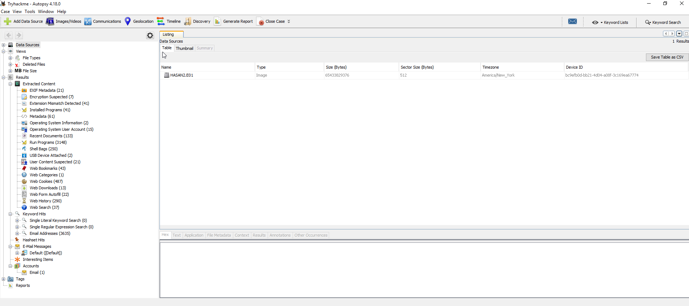

## Domanda numero 1

- What is the MD5 hash of the E01 image?

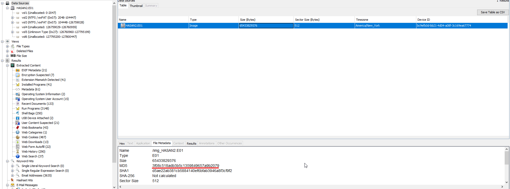

## Domanda numero 2

- What is the computer account name?

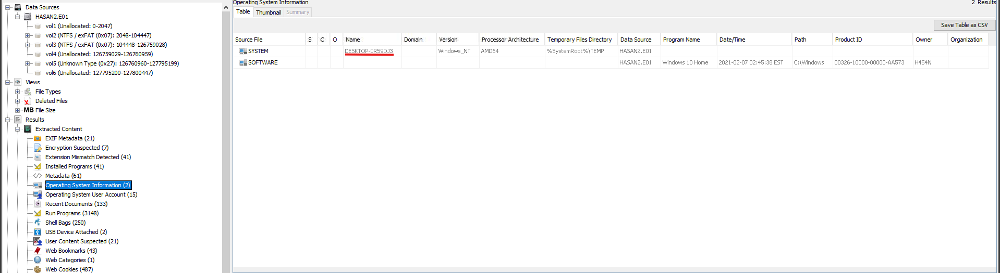

## Domanda numero 3

- List all the user accounts. (alphabetical order)

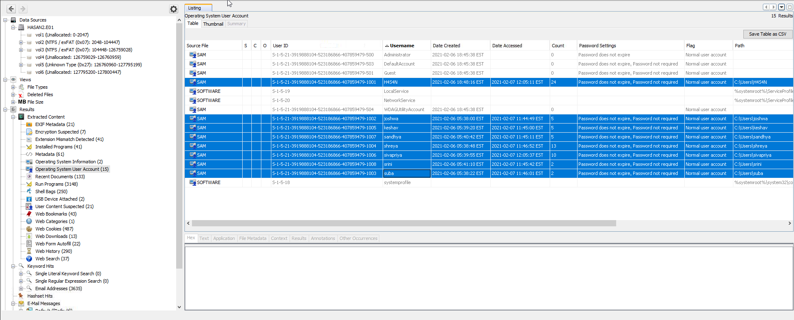

H4S4N,joshwa,keshav,sandhya,shreya,sivapriya,srini,suba

## Domanda numero 4

- Who was the last user to log into the computer?

## Domanda numero 5

- What was the IP address of the computer?

Non ho trovato directory DHCP né tracce utili nei cookie del browser.  
Ho quindi esplorato manualmente la cartella Program Files (x86) alla ricerca di software di **terze parti**.  

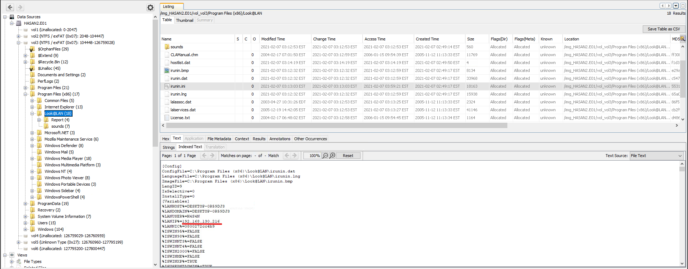

>Durante l’analisi non ho trovato l’indirizzo IP nei registry o nei log di sistema.  
Ho quindi approfondito la ricerca e, grazie a risorse esterne, ho individuato che l’informazione era contenuta nel file `Program Files (x86)\Look@LAN\irunin.ini`.   

>[!NOTE]
*Questo evidenzia come gli artefatti di rete possano trovarsi anche in software di terze parti e non solo nei percorsi canonici di Windows.*

## Domanda numero 6

- What was the MAC address of the computer? (XX-XX-XX-XX-XX-XX)

`%LANNIC%` sempre nello stesso file ci indica il MAC Address associato alla Network Interface Card del PC.

.png)

## Domanda numero 7

- What is the name of the network card on this computer?

Il nome della Network Interface Card si trova nell'hive system in:
`HKLM\SYSTEM\CurrentControlSet\Control\Class\{4d36e972-e325-11ce-bfc1-08002be10318}`

L'hive SYSTEM si trova in:  
`Windows/System32/config/SYSTEM`  
Quindi **estraggo il file** da Autopsy (Tasto destro > Estrai) e poi lo si esplora ad esempio con Registry Explorer (EZtool).

Risposta: Intel(R) PRO/1000 MT Desktop Adapter

## Domanda numero 8

- What is the name of the network monitoring tool?

Nei programmi installati, cercando la loro funzionalità su internet ho trovato:

**Cosa ho trovato su internet:**   
Look@Lan is an advanced network monitor that allows you to monitor your net in few clicks. Extremely easy to use and very fast in discovering your network's active nodes.

Main Features:
- Auto-Detect of Network Settings
- Scanning of one or more Scan-Ranges
- Complete Management of Network Profiles
- World's Faster Node Discovery Scan
- Automatic and Manual Network Configuration
- Network Statistics and Graphs
- Profile Export (text and HTML)
- Advanced Trapping
- Network Log
- Network Tree View
- Proof Single Node Scan
- Reporting

## Domanda numero 9

- A user bookmarked a Google Maps location. What are the coordinates of the location?

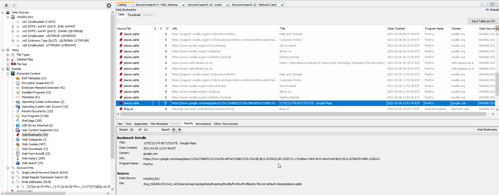

12°52'23.0"N 80°13'25.0"E

## Domanda numero 10

- A user has his full name printed on his desktop wallpaper. What is the user's full name?

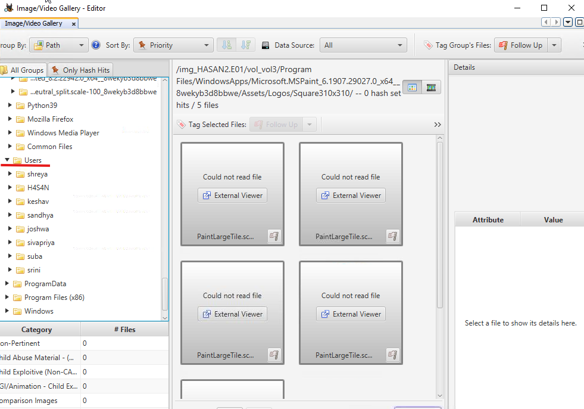

Cercando tra i vari utenti (partendo da images/video) joshwa ha lo sfondo con il suo nome: Anto Joshwa

## Domanda numero 11

- A user had a file on her desktop. It had a flag but she changed the flag using PowerShell. What was the first flag?

Per prima cosa scopro l'utente assieme al file in questione

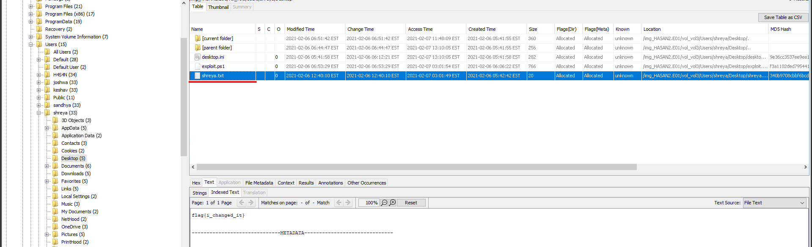

Ed ora cerco informazioni tramite una Keyword search riguardo al file in questione:

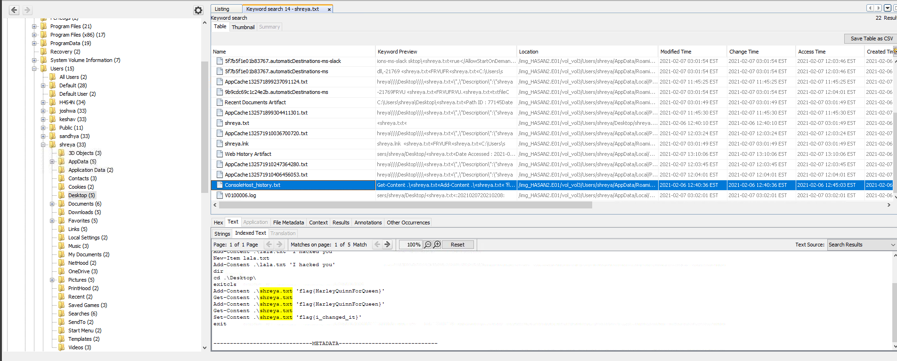

## Domanda numero 12

- The same user found an exploit to escalate privileges on the computer. What was the message to the device owner?

Il device owner è H4S4N.

Il messaggio trovato è: flag{i-hacked-you}

## Domanda numero 13

- 2 hack tools focused on passwords were found in the system. What are the names of these tools? (alphabetical order)

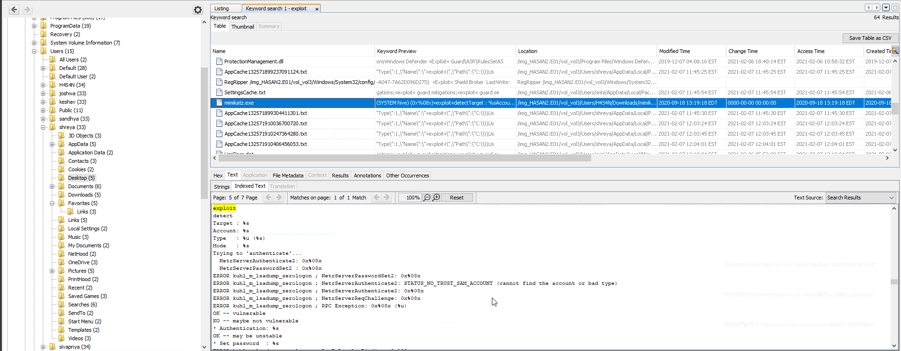

>Metasploit offers Mimikatz and Kiwi extensions to perform various types of credential-oriented operations, such as dumping passwords and hashes, dumping passwords in memory, generating golden tickets, and much more

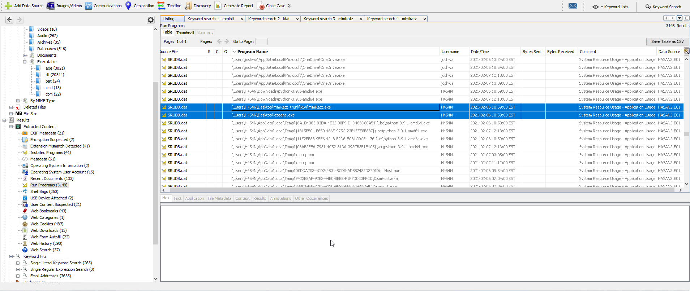

>LaZagne is a lightweight command-line tool designed to help you recover lost or forgotten password from the most commonly used browsers, a couple of email clients and even some FTP transfer and system administration tools.

Quindi i 2 hack tools sono: Mimikatz e LaZagne.  

## Domanda numero 13

- There is a YARA file on the computer. Inspect the file. What is the name of the author?

Cerco per estensione .yar e trovo:

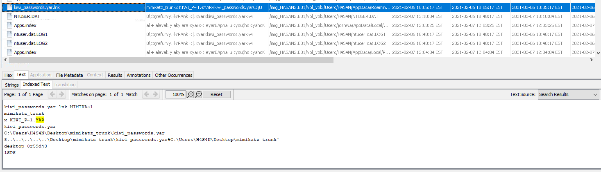

Cerco poi il file kiwi_passwords.yar e riesco a recuperare l'autore:

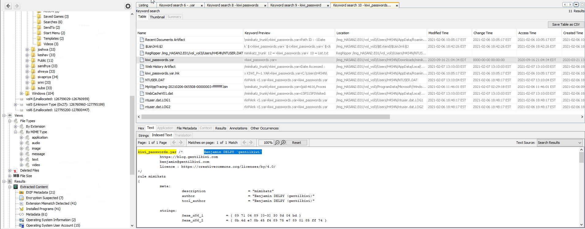

## Domanda numero 14

- One of the users wanted to exploit a domain controller with an MS-NRPC based exploit. What is the filename of the archive that you found? (include the spaces in your answer) 

Nella fase di ricerca trovo vari riferimenti a "Zerologon", eccone uno tra questi:

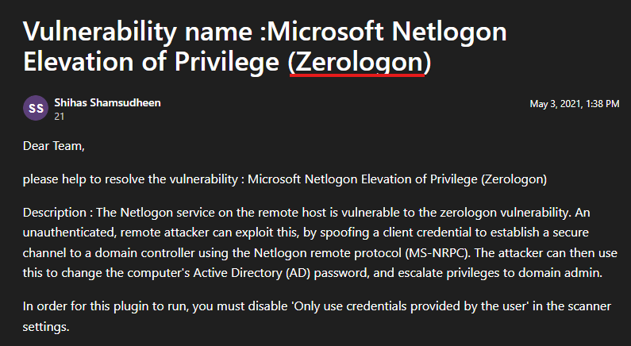

Ed ecco cosa scopro effettuando una Keywordsearch:

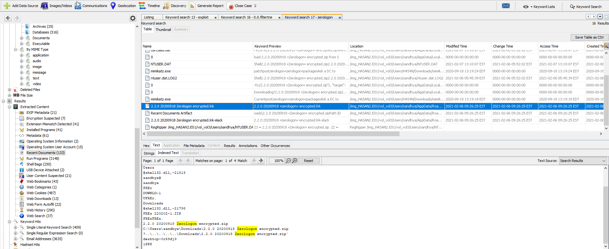

Il nome dell'archivio è quindi: 2.2.0 20200918 Zerologon encrypted.zip

---
🔗 [TryHackMe – Autopsy Case](https://tryhackme.com/room/autopsy2ze0)

---

>📄Documento curato da **Diego Bonatti**  
💻Portfolio tecnico: [GitHub](https://github.com/diego-bonatti)  
📬Contatto: diego.bonatti.fdi@gmail.com