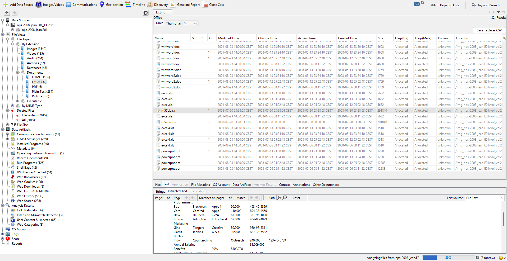
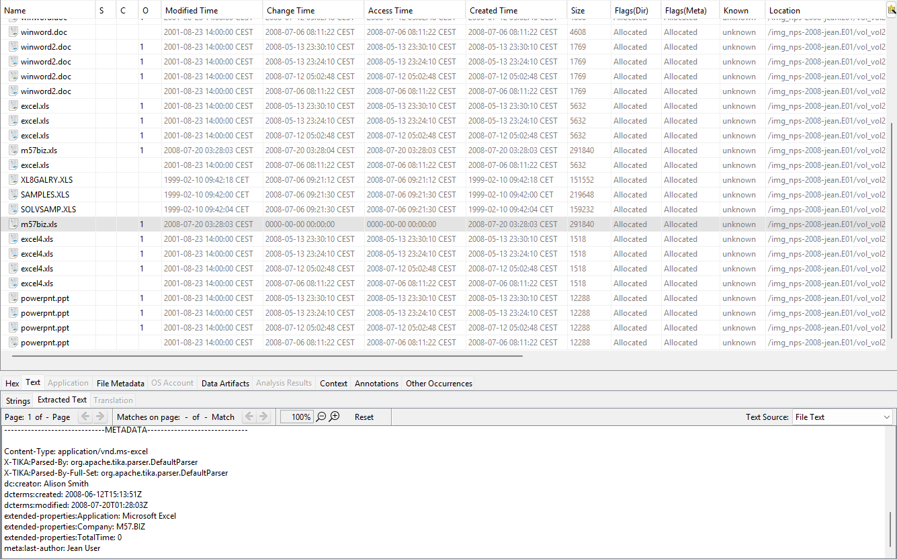
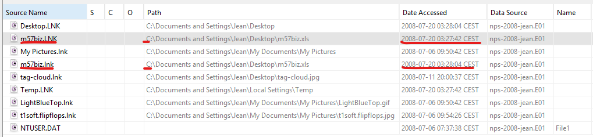
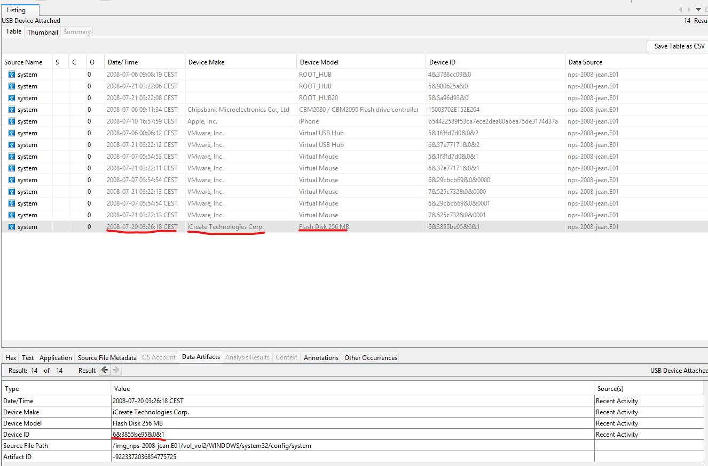
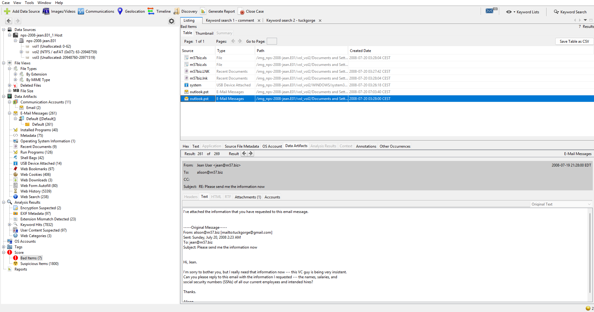
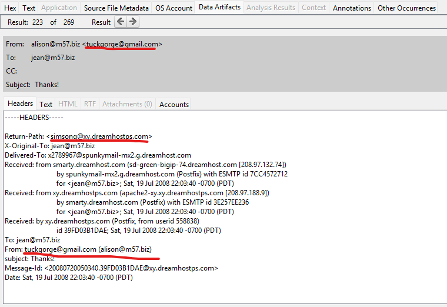
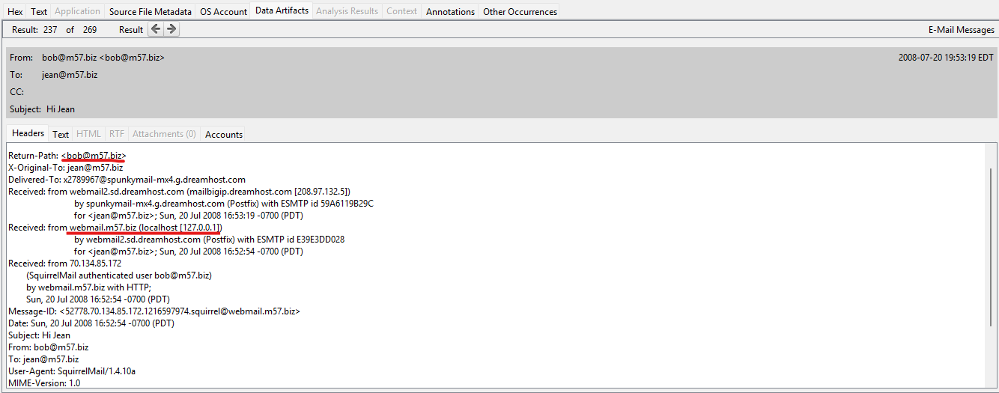
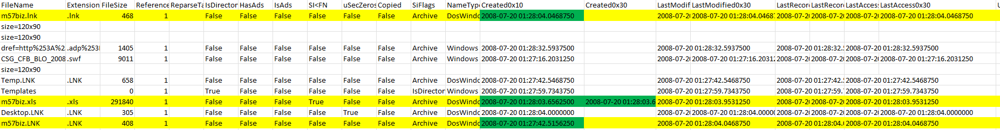

# Indagine Forense, caso M57-Jean

Inizio creando un nuovo caso su **Autopsy** e caricando le immagini del disco sul programma.

Identifico il file contenente le informazioni sui dipendenti (excel):

- `m57biz.xls`
  

>Noto che le **date di creazione tra file system e metadati del file sono differenti**, ciò significa che il file è stato copiato e non ha origine diretta da questo PC.

>Il file potrebbe quindi essere stato copiato da un dispositivo USB o scaricato da internet, da verificare.

Data e ora in cui il file è stato copiato nel dispositivo: **2008-07-20, 03:28:03**

---

Da qui capiamo che dopo averlo copiato il file è stato aperto...  
Ma attenzione perchè prima notiamo già un'apertura, **prima della creazione del file** e nello stesso percorso (non è stato aperto da un altro dispositivo USB, ma dal PC stesso!).
> Il file è stato aperto una prima volta, poi aggiornato (copiato o sovrascritto), e infine riaperto — e ogni apertura ha generato un file .lnk distinto, anche se puntano allo stesso percorso.

---

Notiamo che alla data e ora: **2008-07-20, 03:26:18** è stata **collegata una chiavetta USB**, 2 minuti prima della creazione del file!

---

Controllando le mail ho trovato:

Jean alla data e ora: **2008-07-20, 03:28:00** ha inviato il contenuto del file
ad alison@m57.biz [`mailto:tuckgorge@gmail.com`]!!!

---

## Prova finale

Il mittente `tuckgorge@gmail.com` ha inviato un’email **fingendosi** Alison,   usando il campo From: per mascherarsi.  
Il server di invio non è autorizzato dal dominio M57, quindi non è legittimo.

Ecco cosa è accaduto secondo me in base a quello che ho trovato:

>1. Creazione di un account su DreamHost  
• 	L’attaccante crea un account email su un dominio gestito da DreamHost (es. )  
• 	Oppure usa un server condiviso con accesso   

> 2. Invio dell’email con  falsificato  
• 	L’email viene inviata da `tuckgorge@gmail.com`  
• 	Ma nel campo  viene scritto `alison@m57.biz` come alias  
• 	Il server DreamHost non verifica se l’indirizzo  è legittimo  

> 3. Il destinatario riceve l’email “da Alison”  
• 	Il client di posta mostra `alison@m57.biz` come mittente  
• 	Ma l’intestazione (`xy.dreamhostps.com` ) rivela che è stata inviata da un server esterno non autorizzato

Quindi:
- Il mittente reale è `tuckgorge@gmail.com`, non `alison@m57.biz`
- Il server di invio (`dreamhostps.com`) non è autorizzato dal dominio M57.biz
- Il campo `From:` è manipolato per simulare un mittente interno

## Esempio di una mail legittima, da confrontare con l'altra:

Qui notiamo:

✅ `Return-Path: bob@m57.biz`
- Il mittente è `bob@m57.biz`, un indirizzo interno al dominio aziendale
- Il `Return-Path` corrisponde al `From:` → nessuna mascheratura  
---

✅ `Received: from webmail.m57.biz (localhost [127.0.0.1])`
- L’email è stata inviata da `webmail.m57.biz`, il server di posta dell’azienda
- Il riferimento a localhost (127.0.0.1) indica che è stata inviata tramite webmail interna, non da un server esterno

## Extra:

Verifico se il file fosse già esistente nel PC prima della copia da chiavetta USB.
- Uso FTK_Imager per estrarre dall'immagine `$MFT`

>Eseguo il comando: `MFTECmd.exe -f "C:\Percorso\$MFT" --csv "C:\Percorso\output.csv"`

Questa contraddizione suggerisce che:

- Il file **non era già presente su `C:\`**
- È stato **copiato da una fonte esterna** (es. chiavetta USB)
- È stato **aperto immediatamente dopo la copia**
- Il `.lnk` riflette solo il percorso locale post-copia, non l'origine

> La discrepanza temporale tra apertura e creazione è una prova chiave che il file è stato **importato nel sistema**, non generato internamente.

>**Quindi no, il file non esisteva già da prima nel sistema!**
