# Caso Stanza KAPE

Organization X has an Acceptable Use Policy for their Portable Devices, including Laptops.  
 This policy forbids users from connecting removable or Network drives, installing software from unknown locations, and connecting to unknown networks.   
 It looks like one of the users has violated this policy.   
 Can you help Organization X find out if the user violated the Acceptable Use Policy on their device?   

---

Estratto **KapeTriage** e **Registry Hives**, consultato USBSTORE nell'hive: SYSTEM

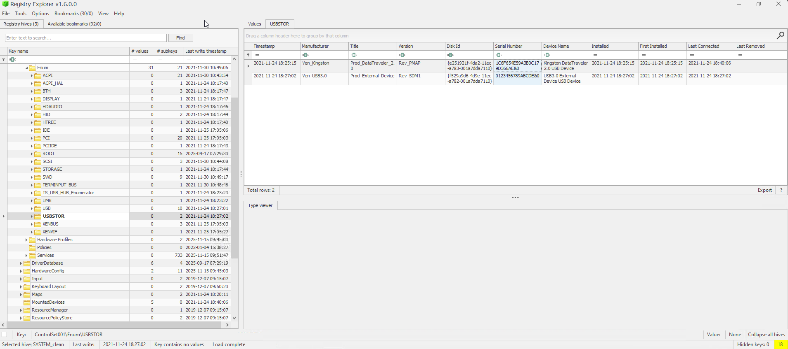

1C6F654E59A3B0C179D366AE è il serial number

---

- Controllo Amcache, cerco il path degli eseguibili: Amcache_UnassociatedFileEntries.csv (non ho trovato nulla di rilevante).
- Controllo: ShimCache (AppCompatCache) SYSTEM\CurrentControlSet\Control\Session Manager\AppCompatCache   
- Controllo Prefetch (non ho trovato nulla di rilevante)


>[!NOTE]
I **Jump Lists** registrano file aperti con applicazioni, anche se eseguiti da unità di rete. Se l’utente ha lanciato il setup da Z:\Installers, quella voce sarà nei Jump Lists.  
In Automatic Destinations

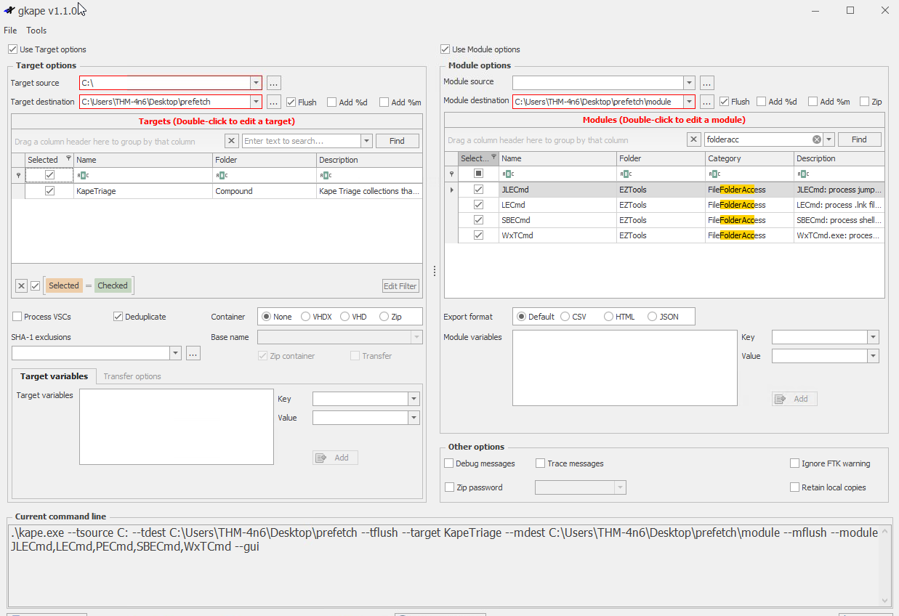

Analizzando le Jump Lists in AutomaticDestinations.csv, tramite EzViewer ho trovato:

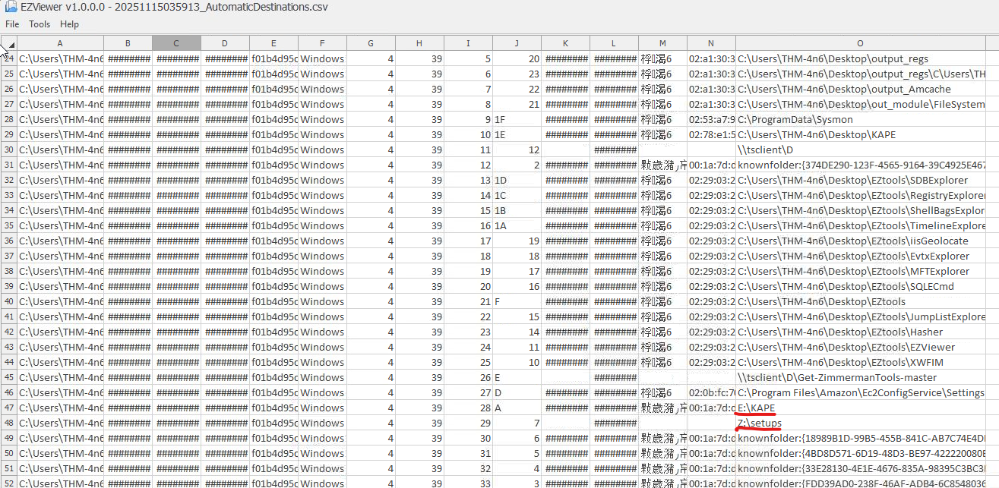


## Domanda 3

Quando il programma: `CHROMESETUP.EXE` è stato eseguito?

>Dal poster guida di **SANS** nella categoria **Program Execution**:    
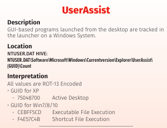

Analizzo quindi il registro e infatti trovo:

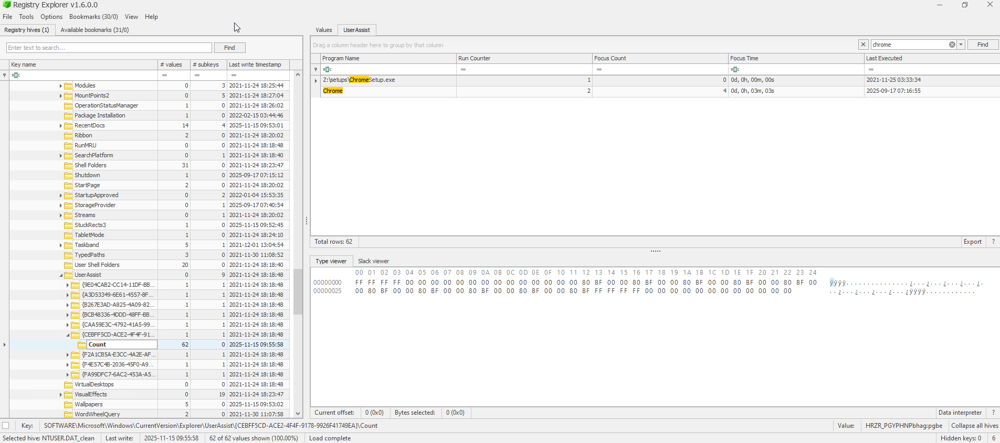


## Domanda 4

Che cosa è stato cercato dalla **barra di ricerca** dello **START menu**?  

>Dal poster guida di **SANS** nella categoria **Deleted File or File Knowledge**:  
>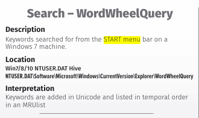


Analizzo quindi il registro e trovo:

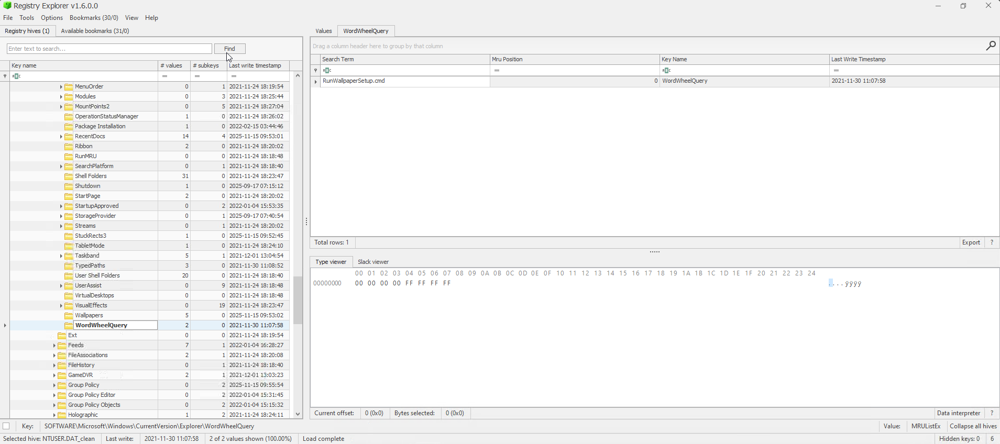

è stato cercato quindi *RunWallpaperSetup.cmd*


## Domanda 5

Quando si è connesso alla prima volta alla **Network 3**?

>Dal poster guida di **SANS** nella categoria **Network Activity/Physical Location**:  
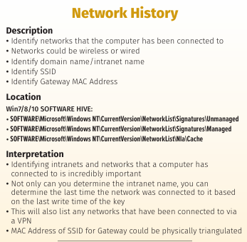


Analizzo quindi il registro e noto:

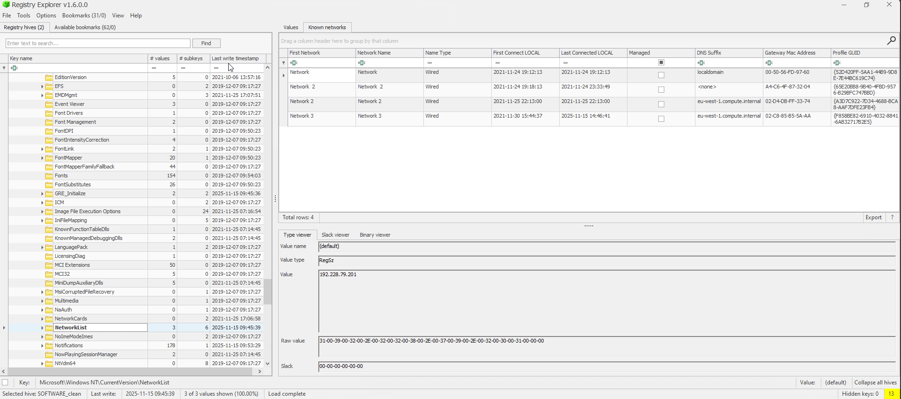


## Domanda 6
Come si chiama l'unità USB da cui è stato installato KAPE?

Ho trovato i nomi delle USB collegate: D, E, in `SYSTEM\MountedDevices`

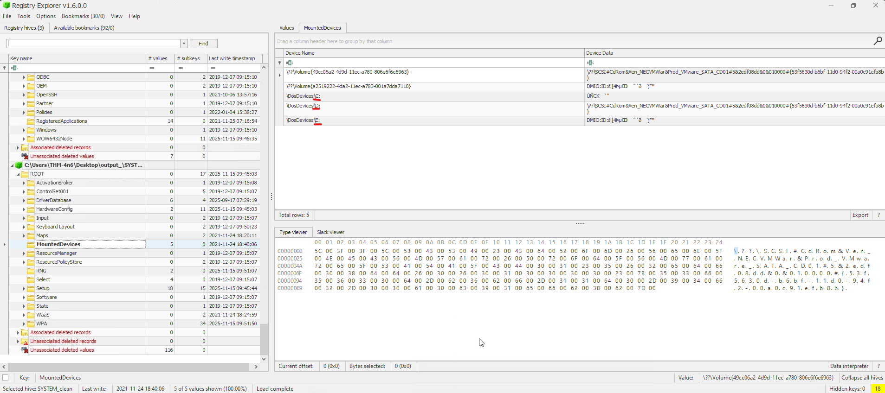


Analizzo le Jump Lists: (-d directory)
```powershell
JLECmd.exe -d "C:\Users\THM-4n6\Desktop\output_target\C\Users\THM-4n6\AppData\Roaming\Microsoft\Windows\Recent\AutomaticDestinations" --csv "C:\Users\THM-4n6\Desktop\toolsout"
```

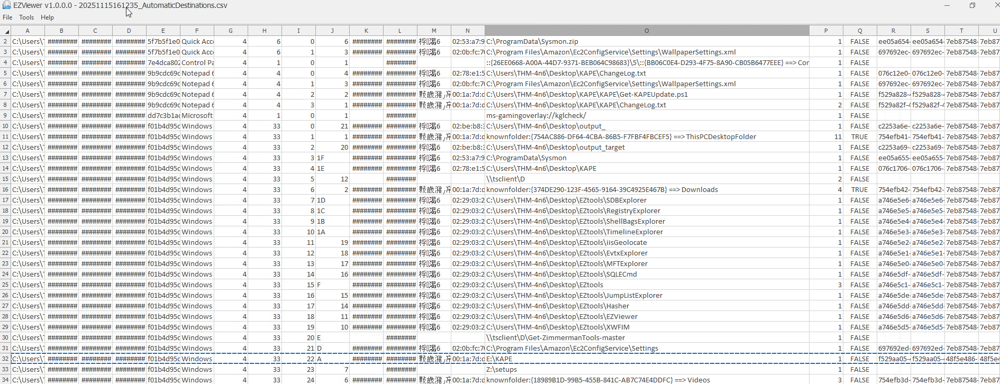

---

>📄Documento curato da **Diego Bonatti**  
💻Portfolio tecnico: [GitHub](https://github.com/diego-bonatti)  
📬Contatto: diego.bonatti.fdi@gmail.com