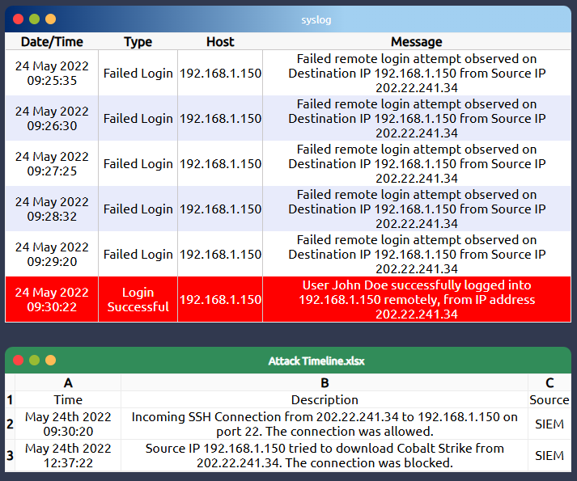

# 🧠 DFIR Introduzione
  DFIR= Digital Forensics and Incident Response

## 🔍 Di cosa si occupa
- **Individuare le prove dell’attività dell’attaccante** nella rete, distinguendo tra falsi allarmi e incidenti reali.
- **Rimuovere in modo efficace l’attaccante**, assicurandosi che non rimanga alcun punto d’appoggio nella rete.
- **Identificare l’entità e il periodo della violazione**, per poter comunicare correttamente con le parti interessate.
- **Analizzare le vulnerabilità** che hanno permesso la violazione, e capire cosa va modificato per evitarla in futuro.
- **Comprendere il comportamento dell’attaccante**, per bloccare preventivamente ulteriori tentativi di intrusione.
- **Condividere le informazioni sull’attaccante con la comunità**, contribuendo alla difesa collettiva.

## 🎯 Concetti base DFIR
- `Artefatto`: una prova che ci aiuta a comprendere cosa è successo
- `Non alterazione delle prove`: non dobbiamo modificare le prove originali (copia forense)
- `Catena di custodia`: documentazione che indica chi possiede e chi ha posseduto precedentemente la prova
- `Ordine di volatilità`: la RAM ha precedenza rispetto all'hard disk, visto che è una memoria volatile, quindi acquisirò prima essa
- `Creazione timeline`: dopo aver acquisito artefatti e averne mantenuto l'integrità, dobbiamo presentarli in ordine cronologico, per poterci lavorare meglio
  
---

## 🛂 Screenshot attività analisi e report


---
## Sintassi DFIR per il successivo paragrafo
### 🧩*Parsing*:

>Il parsing è il processo di interpretazione strutturata di dati già esistenti, leggendo file o artefatti secondo il loro formato noto

- Leggere un file di log e estrarre timestamp, IP, messaggi
- Analizzare il registro di Windows con strumenti che conoscono la struttura delle chiavi


### 🧱*Carving*:

>Il carving è il processo di estrazione di dati grezzi da un supporto (es. disco, immagine forense) senza fare affidamento sul file system

- Recuperare un file cancellato cercando la sua firma binaria
- Estrarre immagini JPEG da uno spazio non allocato (quando elimino un file, lo spazio di memoria viene deallocato, non sovrascritto da zeri!)


### 🧪*Triage*:

>Il triage è la fase iniziale di una risposta forense, in cui si valuta rapidamente un sistema per decidere cosa acquisire, cosa analizzare e in che ordine


## 🛠️ DFIR Tools

### `KAPE`: 
- Automatizza la **raccolta mirata** di artefatti (log, file di sistema, chiavi di registro, ecc.)
- Utilizza **parsing** (non carving) per estrarre informazioni strutturate
- Aiuta a **costruire una timeline degli eventi**, utile per ricostruire l’attività dell’attaccante
- Può essere usato sia in fase di **triage** che in analisi approfondita

### `Autopsy`:
- Analisi di dischi e immagini forensi (`.E01`, `.dd`, `.raw`)
- Recupero di file cancellati tramite **carving**
- **Parsing** di artefatti: log, registro di Windows, cronologia browser, email
- Costruzione di **timeline** degli eventi
- Ricerca di ****parole chiave** e confronto di hash con database noti (es. NSRL)
- Moduli automatici per analisi Android, file embedded, estensioni sospette


### `Velociraptor`:
- Raccolta remota di artefatti tramite query VQL (Velociraptor Query Language)
- Analisi live di processi, file, registro, connessioni
- Timeline e tracciamento attività utente
- Interfaccia web per gestione centralizzata


### `Volatility`:
- Analisi di immagini RAM (`.raw`, `.mem`)
- Identificazione di processi, connessioni, DLL, handles
- Estrazione di comandi, cronologia, chiavi di registro
- Supporto per Windows, Linux, macOS

```bash
volatility3 -f memory.raw windows.pslist
volatility3 -f memory.raw windows.netscan
```

### `Redline`:
- Acquisizione e analisi di processi, connessioni, DLL, chiavi di registro
- Costruzione di timeline dettagliate
- Analisi di esecuzioni sospette e persistence
- Interfaccia grafica per analisi manuale
---
## 🚶‍➡️ Procedimento:

- `Preparazione`: prima dell'incidente, tutto deve essere pronto
- `Identificazione`: incidente identificato da indicatori, documentare e avvisare
- `Contenimento`: cercare di limitare l'effetto dell'incidente
- `Eradicazione`: rimuovere la minaccia, verificando che non ci siano altre falle
- `Riabilitazione`: i servizi che sono stati attaccati tornano operativi
- `Fase finale`: documentazione finale, che cosa è successo e come, procedere con migliorie delle difese

`Incident Handler's Handbook SANS:` [**qui**](https://www.sans.org/white-papers/33901)

---

🔗 [TryHackMe – Introductory DFIR Room](https://tryhackme.com/room/introductoryroomdfirmodule)

---

>📄Documento curato da **Diego Bonatti**  
💻Portfolio tecnico: [GitHub](https://github.com/diego-bonatti)  
📬Contatto: diego.bonatti.fdi@gmail.com
