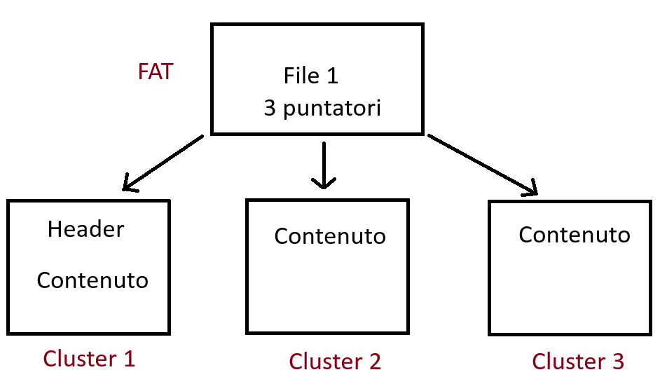

# FAT file system (File Allocation Table)

La File Allocation Table è una struttura che tiene traccia di dove sono memorizzati i file su un disco.  
>Ogni file è suddiviso in **`cluster`** (basic storage unit), e la FAT registra quali cluster appartengono a quale file,   
formando una sorta di lista concatenata.

>[!NOTE]
>- FAT12 = 2^12 = (2^10)x(2^2) = 1024x4 = 4096 **numero massimo di cluster**  
> La dimensione dei cluster e il loro numero **aumenta** andando avanti con FAT16...  
> - *Più grande è il disco, più grande deve essere la dimensione del cluster per restare entro il limite massimo di cluster*.  
> - Una **`directory`** è come una cartella che contiene **informazioni sui file** e sulle sottocartelle al suo interno
> - Quindi FAT32 a parità di spazio, rispetto a FAT16, conterrà più cluster e più piccoli!

---

### Funzionamento FAT esempio

Supponiamo che un file sia composto da 3 cluster, la FAT punta come un puntatore a queste 3 parti del file per costruirlo, quindi il file frammentato in memoria poi verrà ricostruito così.  
Inoltre quando elimino il file, elimino la voce che contiene i puntatori verso i cluster, ma non elimino i cluster direttamente finchè non li sovrascriverò!

---

### Accenno ad ExFAT

Il file system exFAT è stato introdotto da Microsoft per superare i limiti di FAT32, soprattutto su dispositivi di archiviazione rimovibili come chiavette USB, schede SD e dischi esterni.

- exFAT è progettato per **gestire file di grandi dimensioni** e volumi estesi, mantenendo una struttura semplice e compatibile.  
>[!NOTE]
>**FAT32** ha 28 bits indirizzabili, la grandezza massima supportata che un file può avere è di: `4GB`

# NTFS file system (New Technology File System)

## 📰 Journaling
Mantiene un log dei cambiamenti che avvengono ai metadati nel volume.  
Questo log è immagazzinato in: `$LOGFILE`, per questo l'NTFS è chiamato **journaling** file system.  

## 🛂 Access Controls
>[!NOTE]
>Il file system FAT non gestisce permessi di accesso: chiunque può leggere, scrivere o cancellare file, indipendentemente dall’utente.  

>Al contrario, NTFS supporta permessi granulari basati sugli utenti e sui gruppi, grazie al sistema di ACL (Access Control List).  
>Questo permette di definire **chi può fare cosa su ogni file o cartella**: lettura, scrittura, esecuzione, modifica, ecc  

## 💿 Volume Shadow Copy

VSS (Volume Shadow Copy Service) è una tecnologia integrata in Windows che consente di creare copie di backup istantanee di file o volumi. Funziona solo su volumi formattati in NTFS.

>Queste copie sono chiamate shadow copies e permettono di accedere a versioni precedenti dei file anche se sono stati modificati o cancellati.

## 📊 ADS (Alternate Data Streams)

Gli ADS non sono metadati, ma flussi di dati aggiuntivi
- I metadati sono informazioni strutturali sul file: nome, dimensione, timestamp, permessi, ecc.  
- Gli Alternate Data Streams (ADS) sono **dati veri e propri**, come contenuto testuale, binario, script, ecc., associati al file ma **invisibili** agli strumenti tradizionali.  
>Quindi: non sono metadati, ma dati nascosti

## 🗃️ MFT (Master File Table)

 La MFT è una **tabella** che contiene una **voce per ogni file e directory**, con tutti i metadati e riferimenti ai dati.  
 È **fondamentale** per l’analisi forense perché conserva informazioni anche su file cancellati.

>La Master File Table (MFT) è una struttura centrale in NTFS che funziona come un registro dettagliato di tutti i file e cartelle presenti sul volume.  
*Ogni file, inclusi quelli di sistema, ha una entry nella MFT*.  
Anche la MFT stessa è un file (`$MFT`) e ha una propria entry nella tabella.

>[!NOTE]
> - Se il file è piccolo, il contenuto può essere resident (dentro la MFT).
> - Se è grande, il contenuto è non-resident (memorizzato altrove, con puntatori nella MFT).

# File importanti nella MFT:
Questi sono i file più imporanti presenti nella MFT parlando in ambito forense:   
- `$MFT`
- `$LOGFILE`
- `$UsnJrnl`  

---

1) 🗃️ `$MFT`
- La Master File Table: contiene una voce per ogni file e directory del volume.
- Include **metadati**, timestamp, attributi, e puntatori ai dati.
- Anche i file cancellati possono lasciare tracce nella MFT finché non vengono sovrascritti.  
  
2) 📒 `$LOGFILE`
- File di journaling NTFS.
- Registra operazioni di **scrittura e modifica** per garantire **consistenza in caso di crash**.
- Può contenere tracce di attività recenti, anche se non visibili nel file system.

3) 📰 `$UsnJrnl`
- Update Sequence Number Journal.
- Tiene traccia di tutte le **modifiche ai file**: creazione, cancellazione, rinomina, modifica.
- Fondamentale per ricostruire la cronologia degli eventi su un sistema NTFS.

## MFTECmd.exe (tool di Eric Zimmerman)
Che file può analizzare (facendo parving):
- `$MFT` → recupero file cancellati, analisi timestamp, rilevamento timestomping
- `$J` → ricostruzione cronologia attività utente
- `$LogFile` → verifica integrità e operazioni recenti
- `$Boot` → Contiene il codice di avvio e informazioni sul layout del volume NTFS  
- `SDS` → analisi dei permessi e accessi
- `I30` → rilevamento di file nascosti o manipolati in director

---

### Esempio di comando
`MFTECmd.exe -f "percorso_file/nome_file" --csv "percorso_file/nome_file"`

>[!NOTE]
Poi i file output possiamo aprirli e visualizzarli con `EZViewer`

---
🔗 [TryHackMe – Windows Forensics 2 (modulo 2 e 3)](https://tryhackme.com/room/windowsforensics2)

---

>Documento curato da **Diego Bonatti**  
Portfolio tecnico: [GitHub](https://github.com/diego-bonatti)
