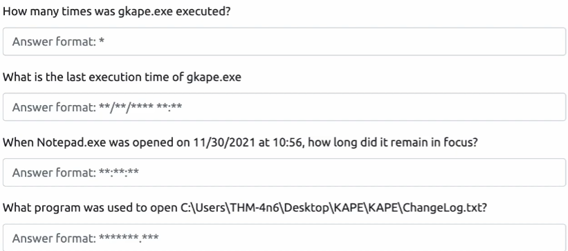

# File eliminati e recupero dati
Quando si eliminano dei file, eliminiamo i puntatori che costruiscono il file,
ma non il contenuto vero e proprio, che rimane sparso nella memoria (in cluster) finchè non viene sovrascritto.

>[!NOTE]
>- Viene rimossa la voce nella directory che indicava il file.  
>- Vengono eliminati i puntatori nella FAT o nella MFT che collegavano i cluster.
>- I cluster fisici che contenevano il contenuto rimangono intatti, ma non sono più referenziati.
>- Il sistema li considera “liberi”, e li riutilizzerà solo quando servirà spazio per nuovi file

Con **Autopsy** possiamo recuperare questi dati eliminati

## Concetti teorici

- **`Allocated`**: lo spazio è occupato da un file attivo, referenziato dal file system.  
Il contenuto è utilizzato e visibile, i cluster sono assegnati.
- **`Unallocated`**: lo spazio è libero per la scrittura, ma può contenere ancora dati residui di file cancellati.  
Non è più referenziato dal file system, ma può essere analizzato e recuperato.

>**Immagine del disco**: copia forense bit a bit del disco che contiene tutto.  
Utile perchè: la prova originale non verrà manipolata e si potranno eseguire più copie su cui lavorare.

**Recupero file con Autopsy:**


# Evidence of Execution


## Windows Prefetch files

Quando un programma viene eseguito su Windows, immagazzina informazioni per usi futuri (in caso di futuri utilizzi).  

>[!NOTE]
>Queste informazioni sono contenute nel percorso: `C:\Windows\Prefetch`.  
I file di Prefetch hanno estensione `.pf`.  

- Ultimo run time
- Numero di esecuzioni del programma
- Elenco dei file aperti o caricati durante l’esecuzione
- Disco da cui è stato eseguito il programma

>Utilizziamo `PECmd` per analizzare questi files  

```powershell
PECmd.exe -f "percorso_file.pf" --csv "percorso_output"
```


## Windows 10 Timeline

La Timeline è una funzione di Windows che registra le attività dell’utente per permettere di “**riprendere da dove si era interrotto**”.  
 Dal punto di vista forense, è una fonte preziosa di evidenze, perché conserva:  
- Apertura di documenti (Word, Excel, PDF…)
- Navigazione web (Edge, Chrome con estensione)
- Uso di app e programmi
- Timestamp precisi di ogni attività
- Informazioni sul dispositivo e utente coinvolto

>Questi dati sono salvati nel file:  
`C:\Users\<utente>\AppData\Local\ConnectedDevicesPlatform\L.<SID>\ActivitiesCache.db`

Utilizziamo **`WxTCmd`** per analizzare il file.  
```powershell
WxTCmd.exe -f "percorso_file.db" --csv "percorso_output"
```


## Windows Jump Lists

Le Jump Lists di Windows sono artefatti che registrano l’**interazione dell’utente con applicazioni e file**.  
Sono generate automaticamente dal sistema operativo e possono contenere tracce di **file aperti**, anche se successivamente cancellati o spostati.  
- Cosa contengono:  
  
| Campo                | Descrizione                                                                 |
|---------------------|------------------------------------------------------------------------------|
| Percorso del file    | File aperti con l’app associata                                              |
| Timestamp            | Data e ora di apertura                                                       |
| App associata        | Es. `EXCEL.EXE`, `WINWORD.EXE`                                               |
| Volume ID            | Disco da cui è stato aperto il file                                          |
| Stream di metadati   | Informazioni binarie su file e uso                                           |

>[!NOTE]
>- Un *file è stato aperto* (**Jump List**)
>- Con una *certa app* (**Prefetch**)
>- In un certo *momento* (**Timestamp**)
>- Da un certo *disco* (**Volume ID**)

Si trovano nel percorso:  `C:\Users\<nome_utente>\AppData\Roaming\Microsoft\Windows\Recent\AutomaticDestinations\`.   
E sono analizzabili con il programma: `JLECmd`


## Domande




1) Controllare `Prefetch`, **PECmd**
2) Controllare `Prefetch`/`Windows Timeline`, **PECmd**/**WxTCmd**
3) Controllare `Windows Timeline`, **WxTCmd** (per controllare durata in focus)
4) Controllare `Prefetch`/`Jump Lists`, **PECmd**/**JLECmd**


---
🔗 [TryHackMe – Windows Forensics 2 (modulo 4 e 5)](https://tryhackme.com/room/windowsforensics2)

---

>📄Documento curato da **Diego Bonatti**  
💻Portfolio tecnico: [GitHub](https://github.com/diego-bonatti)  
📬Contatto: diego.bonatti.fdi@gmail.com
