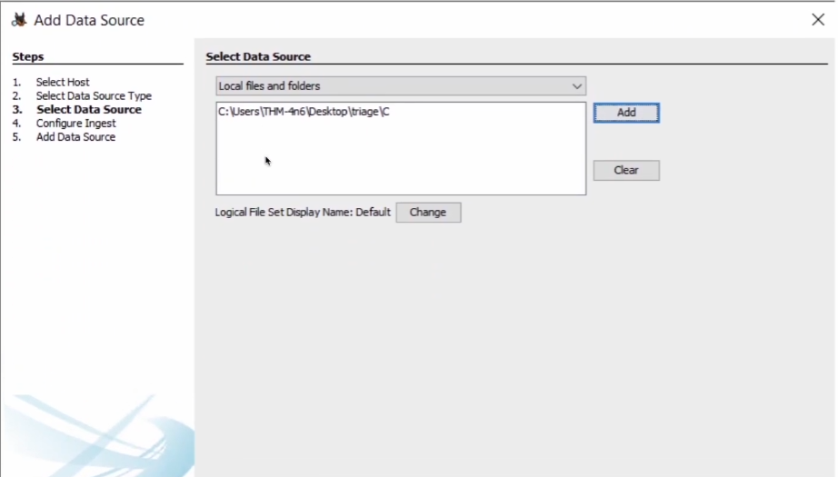

# 📁 Shortcut Files

Windows crea un "Shortcut File" quando un file viene aperto localmente o da remoto.  
Questo file creato contiene informazioni riguardo:

- **Prima volta** in cui il file è stato aperto
- **Ultima volta** in cui il file è stato aperto
- **Percorso** del file aperto
- Altre informazioni

Questi Shortcut files di trovano:  
- `C:\Users\<username>\AppData\Roaming\Microsoft\Windows\Recent\`
- `C:\Users\<username>\AppData\Roaming\Microsoft\Office\Recent\`

>[!NOTE]
> Utilizziamo `LECmd.exe` per analizzare questi files `.lnk`

```bash
LECmd.exe -f <path-to-shortcut-files> --csv <path-to-save-csv>
```


## IE/Edge History (Cronologia Web)

`C:\Users\<username>\AppData\Local\Microsoft\Windows\WebCache\WebCacheV*.dat`

>[!NOTE]
Possiamo utilizzare Autopsy e dargli la stringa precedente in **Logical Files** affichè analizzi tutte le WebCacheV* presenti nella directory.

>Autopsy svolge questa operazione in autonomia e restituisce i risultati nella cartella: `Web History`




>Basta dargli in input la `Triage` (es. KapeTriage) acquisita e mettere la spunta su `Recent Activity` e analizzerà anche la WebCache.


## Jump Lists

Creano una lista degli ultimi files aperti.  
Queste informazioni ci servono per identificare i **files eseguiti ed aperti** in un sistema.  
(visti anche precedentemente)

`C:\Users\<username>\AppData\Roaming\Microsoft\Windows\Recent\AutomaticDestinations`

Utilizziamo `JLECmd.exe`

# 💿 External Devices & USB 

Quando un qualunque nuovo device viene collegato al sistema esso viene salvato in:

- `C:\Windows\inf\setupapi.dev.log`

Questo file di log contiene il **serial number** del device e la **prima/ultima** volta in cui è stato collegato.


---
🔗 [TryHackMe – Windows Forensics 2 (modulo 6 e 7)](https://tryhackme.com/room/windowsforensics2)

---

>📄Documento curato da **Diego Bonatti**  
💻Portfolio tecnico: [GitHub](https://github.com/diego-bonatti)  
📬Contatto: diego.bonatti.fdi@gmail.com

