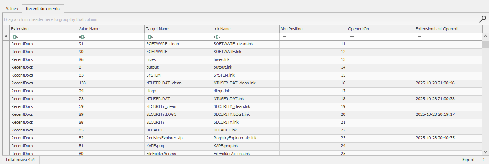

# Usage or knowledge of files/folders

## 📁 File aperti recentemente

Windows mantiene una **lista dei file aperti** recentemente, questa informazione è associata ad un utente specifico.  
`NTUSER.DAT\Software\Microsoft\Windows\CurrentVersion\Explorer\RecentDocs`
> [!NOTE]
> Le informazioni relative a un **utente specifico** si trovano nell’**hive NTUSER.DAT**, che contiene il registro personale dell’utente.  
> Utilizzato Registry Explorer per analisi:

**Espandendo le sottochiavi** di RecentDocs avrò le chiavi per ogni estensione di file. 

---

### Differenza Jump lists e file LNK
- I file `.LNK`  non sono JumpListData, ma entrambi servono a tracciare l’**uso recente di file**.  
I `.LNK` sono singoli collegamenti (creati dall'apertura del file direttamente dall'utente), mentre le Jump Lists sono liste aggregate per applicazione.  
- I `Jump Lists` sono artefatti che registrano **file aperti di recente tramite una specifica app** (es. aperto PDF tramite Microsoft Edge).  
Sono fondamentali per ricostruire l’attività utente e correlare file, timestamp e applicazioni.
>I Jump lists sono ottimi per tracciare l’attività utente su documenti, anche se i file originali sono stati **cancellati**.

`NTUSER.DAT\Software\Microsoft\Windows\CurrentVersion\Search\JumplistData`  
Questa **chiave** è un artefatto utente-specifico che registra file e app lanciati tramite la **ricerca di Windows**.  
È simile ai Jump Lists, ma focalizzata sull’interazione con la funzione di ricerca, non con le app direttamente.

---

## 🔍 File aperti recentemente Office

`NTUSER.DAT\Software\Microsoft\Office\VERSION`, dove VERSION varia appunto in base alla versione di Office, dopo la versione troveremo ad esempio: `\Word`.   
- I file aperti con **Microsoft365** invece si possono trovare in:  
`NTUSER.DAT\Software\Microsoft\Office\VERSION\UserMRU\LiveID_####\FileMRU`

---

## 📁 ShellBags

> [!NOTE]
> I ShellBags sono artefatti che registrano **cartelle aperte e preferenze utente**,  
> anche se le cartelle non esistono più.  
> Sono fondamentali per ricostruire la **navigazione e l’attività utente** nel file system.

- Permettono di sapere **quali cartelle sono state aperte**
- Anche se la cartella è stata **cancellata**, la traccia può rimanere
- Aiutano a ricostruire la **navigazione dell’utente** nel file system
- Possono indicare l’uso di **unità USB**, **cartelle di rete**, o **percorsi sospetti**

### 📁 Dove si trovano

| Hive | Chiave |
|------|--------|
| `USRCLASS.DAT` | `Local Settings\Software\Microsoft\Windows\Shell\Bags` |
| `USRCLASS.DAT` | `Local Settings\Software\Microsoft\Windows\Shell\BagMRU` |
| `NTUSER.DAT` | `Software\Microsoft\Windows\Shell\Bags` |
| `NTUSER.DAT` | `Software\Microsoft\Windows\Shell\BagMRU` |

> Le chiavi `BagMRU` contengono la **struttura gerarchica** delle cartelle,  
> mentre le chiavi `Bags` contengono le **preferenze di visualizzazione**.

---

### 🛠️ Come analizzarli

- **Registry Explorer** mostra le chiavi, ma non è ottimizzato per interpretarle
- Usa **ShellBags Explorer** (Eric Zimmerman):
  - Seleziona l’hive (`USRCLASS.DAT`)
  - Il tool parserizza e mostra:
    - Percorso cartella
    - Timestamp (LastWrite)
    - Tipo di cartella (es. USB, rete, locale)
    - Ordine e layout

---

## 📂 Open/Save Dialog MRUs – Percorsi recenti

Quando un utente apre o salva un file, Windows mostra una finestra di dialogo.  
I percorsi selezionati vengono **memorizzati nel registro**, permettendo di ricostruire **dove l’utente ha navigato**.

---

### 🧠 Chiavi da analizzare

| Hive | Chiave |
|------|--------|
| `NTUSER.DAT` | `Software\Microsoft\Windows\CurrentVersion\Explorer\ComDlg32\OpenSavePIDlMRU` |
| `NTUSER.DAT` | `Software\Microsoft\Windows\CurrentVersion\Explorer\ComDlg32\LastVisitedPidlMRU` |

---

### 🔍 Cosa contengono

- Percorsi di file aperti o salvati
- Ordine MRU (Most Recently Used)
- Timestamp impliciti (LastWrite della chiave)
- Tipologia di file (basata sull’estensione)

> Queste chiavi sono utili per ricostruire **attività utente recente**, anche se i file non esistono più.

---

## 🔎 Explorer Address/Search Bars – Percorsi digitati

Windows memorizza anche i **percorsi digitati manualmente** nella barra degli indirizzi di Esplora Risorse e le **ricerche effettuate**.

---

### 🧠 Chiavi da analizzare

| Hive | Chiave |
|------|--------|
| `NTUSER.DAT` | `Software\Microsoft\Windows\CurrentVersion\Explorer\TypedPaths` |
| `NTUSER.DAT` | `Software\Microsoft\Windows\CurrentVersion\Explorer\WordWheelQuery` |

---

### 🔍 Cosa contengono

- `TypedPaths` → percorsi digitati manualmente (es. `D:\Documenti\Tesi`)
- `WordWheelQuery` → parole chiave cercate (es. “fattura”, “immagini”)
- Ordine MRU
- Tracce di navigazione anche verso **unità USB o di rete**

---

### ✅ In sintesi

> Queste chiavi permettono di ricostruire **dove l’utente ha navigato**, **cosa ha cercato**, e **quali percorsi ha digitato**, anche se i file o le cartelle non esistono più.

---

## Altri Artefatti strutturali e comportamentali

### 🔹 1. MFT (Master File Table)

- *Cos’è*: la “rubrica” del file system NTFS. Ogni file e cartella ha una voce nella MFT.
- *Contenuto*:
  - Nome, percorso, dimensione
  - Timestamp (creazione, modifica, accesso)
  - Attributi e permessi
- *Utilità forense*:
  - Traccia file anche se cancellati (finché non sovrascritti)
  - Fondamentale per ricostruire timeline e attività utente
- *Strumenti*: MFTECmd, Autopsy

---

### 🔹 2. $LogFile

- *Cos’è*: file di log interno a NTFS che registra operazioni sul file system.
- *Contenuto*:
  - Operazioni come Create, Delete, Rename, Write
  - Transazioni NTFS per integrità e recupero
- *Utilità forense*:
  - Conferma azioni su file (es. copia su USB, cancellazione)
  - Può mostrare eventi anche se il file non esiste più
- *Strumenti*: LogFileParser (EZ Tools)

---

### 🔹 3. USN Journal (Update Sequence Number Journal)

- *Cos’è*: registro delle modifiche ai file su volumi NTFS.
- *Contenuto*:
  - Eventi come FileCreate, FileDelete, FileRename, DataOverwrite
  - Associati a timestamp e path
- *Utilità forense*:
  - Traccia attività su file e cartelle in modo dettagliato
  - Ottimo per rilevare copia su dispositivi esterni
- *Strumenti*: MFTECmd (--usnjournal), Autopsy

---

### 🔹 4. Shellbags (viste prima)

- *Cos’è*: struttura nel registro che memorizza le cartelle esplorate in Windows Explorer.
- *Contenuto*:
  - Percorsi esplorati, vista (icone, dettagli), timestamp
  - Anche cartelle su dispositivi rimovibili o cancellati
- *Utilità forense*:
  - Dimostra che l’utente ha navigato una cartella
  - Utile per correlare accessi a USB, cartelle sospette
- *Strumenti*: ShellBagsExplorer, Registry Explorer

---

## 📌 Sintesi comparativa

| Artefatto     | Traccia cosa?             | Persistenza | Utile per…                     |
|---------------|---------------------------|-------------|--------------------------------|
| MFT           | File e cartelle            | Alta        | Timeline, file cancellati      |
| $LogFile      | Operazioni su file         | Media       | Copia, modifica, cancellazione |
| USN Journal   | Modifiche e scritture      | Alta        | Copia su USB, attività file    |
| Shellbags     | Cartelle esplorate         | Alta        | Attività utente, USB browsing  |

---

🔗 [TryHackMe – Windows Forensics 1 (modulo 7)](https://tryhackme.com/room/windowsforensics1)

---

>📄Documento curato da **Diego Bonatti**  
💻Portfolio tecnico: [GitHub](https://github.com/diego-bonatti)  
📬Contatto: diego.bonatti.fdi@gmail.com
