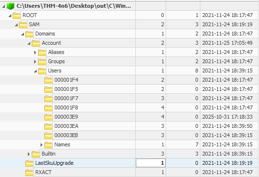
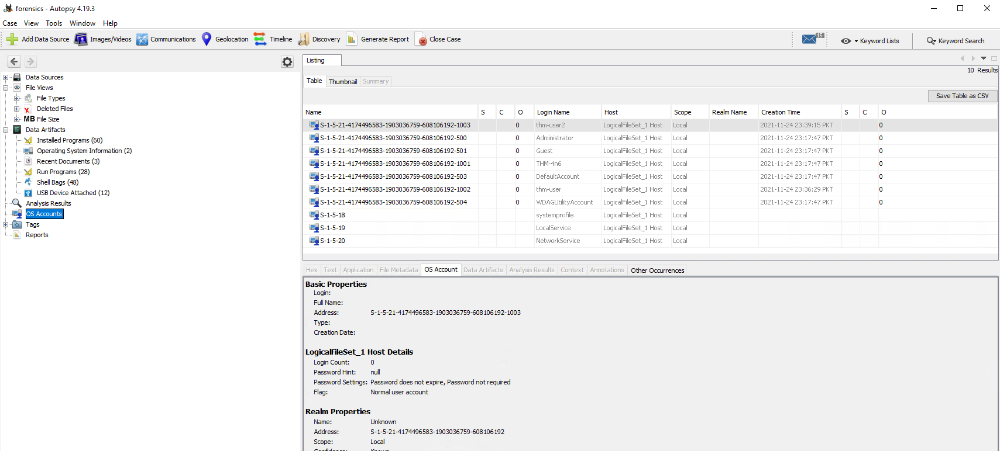
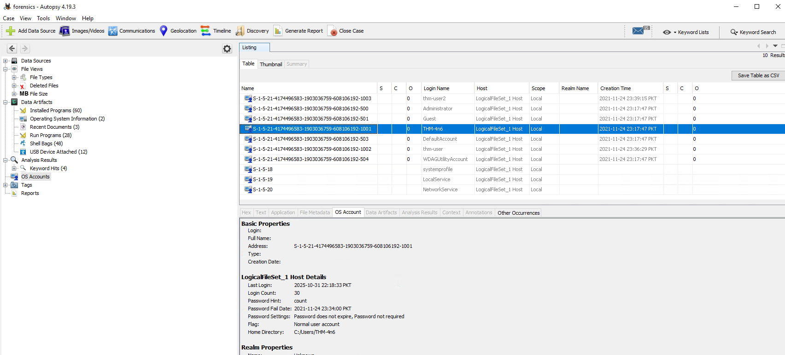
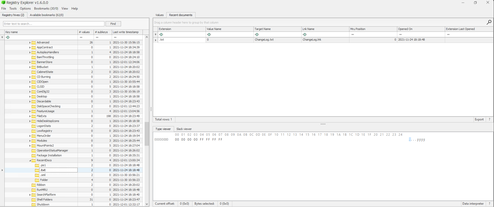
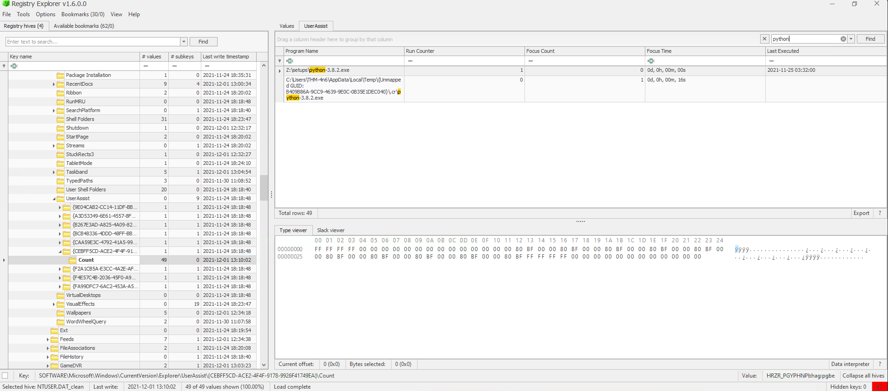
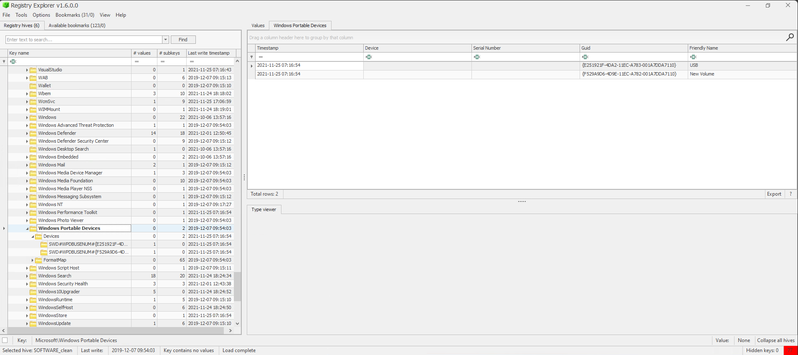
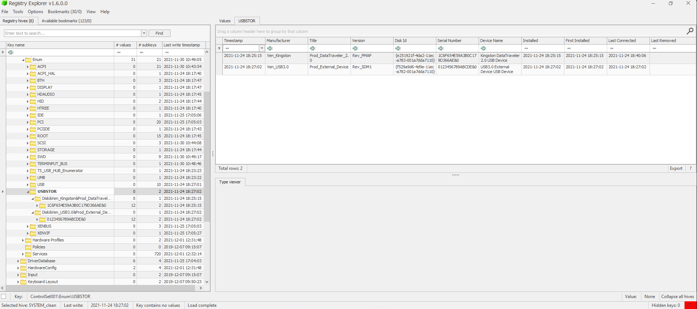

# Prova pratica Hands On

eseguita copia dei registri tramite KAPE (lavoro su **triage**).

## Domanda 1

- How many user created accounts are present on the system? 

Esplorazione dell'insieme di chiavi: `SAM\Domains\Account\Users`
>3, prestare attenzione alle **date di creazione** delle utenze.  
>4 sono create di default, invece 3 sono state create successivamente da utenti.

## Domanda 2

- What is the username of the account that has never been logged in?
>Ho caricato i registry hives estratti con KAPE in **Autopsy** e analizzando  
**OS Accounts** ho controllato la voce: **Login Count**.

## Domanda 3

- What's the password hint for the user THM-4n6?  
>Ho analizzato sempre in Autopsy l'utenza THM-4n6 e ho notato subito il password hint

## Domanda 4

- When was the file 'Changelog.txt' **accessed**?
`NTUSER.DAT\Software\Microsoft\Windows\CurrentVersion\Explorer\RecentDocs`  
Questo percorso contiene informazioni sui file aperti!

## Domanda 5

- What is the complete path from where the python 3.8.2 installer was run? 

Guardare in **UserAssist** perché:  
- **Amcache non sempre registra il percorso completo**
- **UserAssist** è più affidabile per **esecuzioni manuali da GUI**
- Ti serve il **percorso originale** per attribuire l’origine **dell’eseguibile**

`NTUSER.DAT\Software\Microsoft\Windows\Currentversion\Explorer\UserAssist\{GUID}\Count`

## Domanda 6

- When was the USB device with the friendly name 'USB' last connected?

`SOFTWARE\Microsoft\Windows Portable Devices\Devices`
Identifico il **friendly name dei dispositivi USB connessi**!  
Trovo il suo **GUID** associato!

Ora che ho il GUID, vado in:   
- `SYSTEM\CurrentControlSet\Enum\USBSTOR`  

per verificare l'unità con lo stesso **GUID**!  
Qui trovo una lista dei dispositivi di archiviazione collegati **assieme ai timestamp**.

---

🔗 [TryHackMe – Windows Forensics 1 (parte pratica)](https://tryhackme.com/room/windowsforensics1)

---

>Documento curato da **Diego Bonatti**  
Portfolio tecnico: [GitHub](https://github.com/diego-bonatti)
