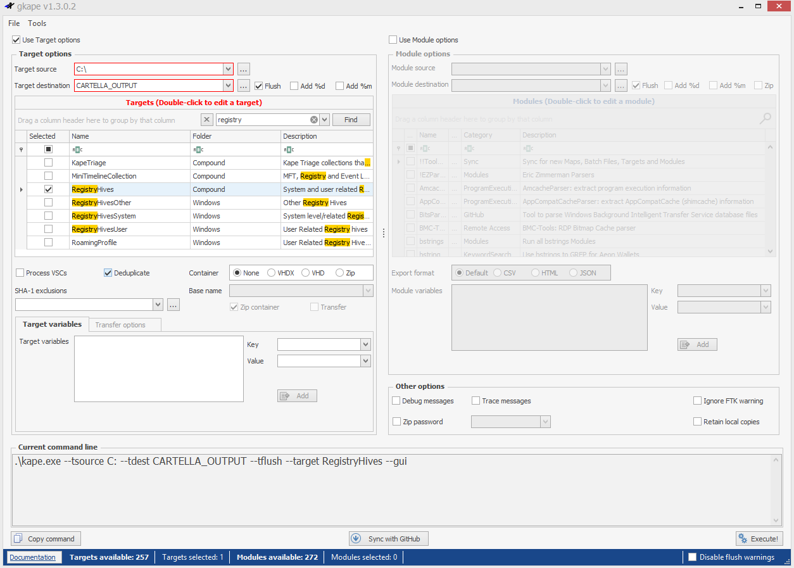

# System Information and System Accounts

Come estrarre informazioni fondamentali dal registro di Windows per identificare il sistema analizzato e i suoi utenti, grazie all'utilizzo di **Registry Explorer**, dopo aver estratto i registri con **KAPE**.

---

---

### 🖥️ Informazioni sul sistema operativo

- **Chiave da analizzare**:  
  `SOFTWARE\Microsoft\Windows NT\CurrentVersion`
- **Dati utili**:  
  - `ProductName` → es. Windows 10 Pro  
  - `CurrentBuildNumber` → es. 19041  
  - `EditionID`, `ReleaseId`, `SystemRoot`, ecc.

---

### 🧩 Control Sets

- **Chiavi**:
  - `SYSTEM\ControlSet001` → config attiva al boot
  - `SYSTEM\ControlSet002` → last known good config
  - `SYSTEM\Select\Current` → indica quale ControlSet è attivo
  - `SYSTEM\Select\LastKnownGood` → indica il ControlSet di backup
  
  >Un “Control Set” nel registro di Windows è un insieme di configurazioni di sistema usate durante l’avvio.  
  Serve a gestire quali driver, servizi e impostazioni vengono caricati.

---

### 💻 Nome del computer

- **Chiave**:  
  `SYSTEM\CurrentControlSet\Control\ComputerName\ComputerName`
- **Valore**:  
  `ComputerName` → nome host del sistema

---

### 🌍 Informazioni sul fuso orario

- **Chiave**:  
  `SYSTEM\CurrentControlSet\Control\TimeZoneInformation`
- **Valori utili**:  
  - `TimeZoneKeyName`  
  - `Bias`, `StandardName`, `DaylightName`

---

### 🌐 Interfacce di rete

- **Chiave**:  
  `SYSTEM\CurrentControlSet\Services\Tcpip\Parameters\Interfaces`
- Ogni interfaccia è rappresentata da un GUID
- Contiene:
  - IP assegnato
  - DHCP IP
  - Subnet mask
  - DNS

---

### 📶 Reti passate

- **Chiavi**:
  - `SOFTWARE\Microsoft\Windows NT\CurrentVersion\NetworkList\Signatures\Unmanaged`
  - `SOFTWARE\Microsoft\Windows NT\CurrentVersion\NetworkList\Signatures\Managed`
- Contengono:
  - Nome rete
  - Ultima connessione (LastWrite)

---

### 🚀 Programmi in avvio automatico

- **Chiavi**:
  - `NTUSER.DAT\Software\Microsoft\Windows\CurrentVersion\Run`
  - `SOFTWARE\Microsoft\Windows\CurrentVersion\Run`
  - `RunOnce`, `Policies\Explorer\Run`
- **Servizi**:  
  `SYSTEM\CurrentControlSet\Services`  
  - `Start = 0x02` → servizio avviato al boot

---

### 👤 Informazioni sugli utenti

- **Hive**: `SAM`
- **Chiave**:  
  `SAM\Domains\Account\Users`
- Contiene:
  - RID utente
  - Numero login
  - Ultimo login e fallimenti
  - Cambio password
  - Gruppi associati

---
>Documento curato da **Diego Bonatti**  
Portfolio tecnico: [GitHub](https://github.com/diego-bonatti)