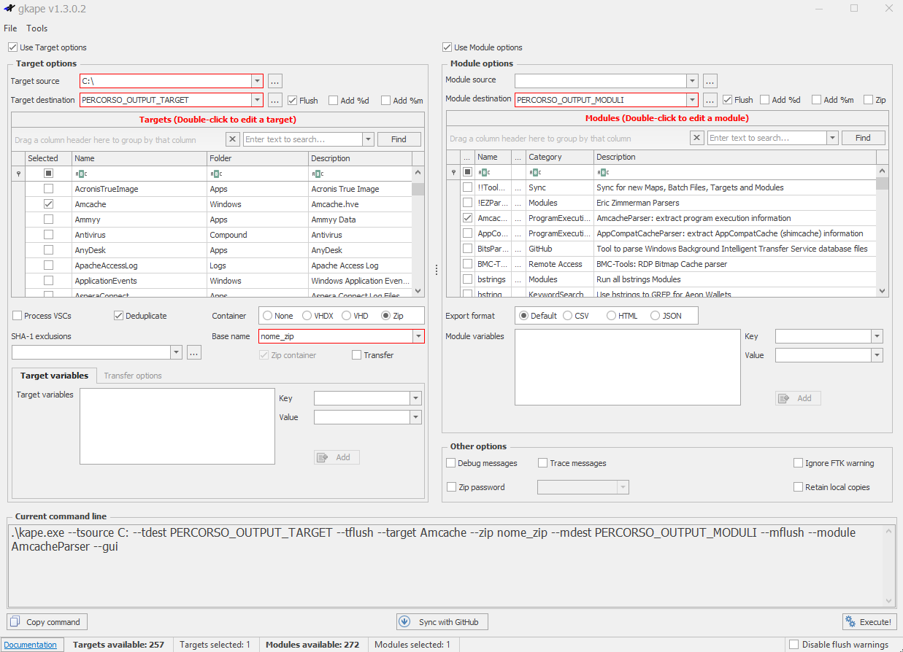

# Windows Forensics

## Data acquisition
Consiste nell'**estrarre le informazioni** dal dispositivo che vogliamo analizzare.  
Creando in questo caso un'immagine del disco e controllandone poi l'**integrità** con l'`hash`.  
  
> Dopo aver creato l'immagine del disco, si calcola un hash crittografico per garantire che:
- L'immagine non sia stata alterata
- Ogni analisi futura sia fatta su una copia verificata

---
## Introduzione a KAPE

Per acquisire i file presenti nel percorso `%WINDIR%\System32\Config` possiamo utilizzare un tool come: **KAPE**.

Che è uno strumento capace di acquisire dati da un **dispositivo live** (tra cui i dati dei registri di cui abbiamo parlato) e capace anche di analisi.

---

### NOTE KAPE

- L'opzione `Flush` serve ad eliminare i contenuti all'interno della directory: **target destination** 

- `VSCs` (Volume Shadow Copies)  
Questa opzione permette a KAPE di acquisire artefatti anche dalle **copie shadow del volume**, cioè snapshot automatici creati da Windows.

- `Deduplicate`  
Questa opzione fa in modo che KAPE **non raccolga file duplicati** (stesso hash) durante l’acquisizione.

- `Container`  
Questa opzione permette di **impacchettare** i risultati in un archivio zip o vhdx

>Un **modulo** è un’azione di elaborazione che KAPE esegue dopo aver raccolto i file con i target.  
Si trovano in: `KAPE\Modules\LiveResponse\Windows\`
- I **target** → **raccolgono** file 
- I **moduli** → **analizzano** quei file con strumenti specifici

---

# Combinazioni KAPE targ/mod

Queste combinazioni ti permettono di acquisire artefatti forensi e ottenere report leggibili (CSV, timeline, ecc.), utili per analisi e documentazione.

---

## 🔐 1. Amcache

- **Target**: `Amcache`
- **Module**: `AmcacheParser`
- **Cosa acquisisce**:  
  File `Amcache.hve` → info su eseguibili installati o eseguiti (SHA1, percorso, timestamp)
- **Output**:  
  CSV con elenco software e attività utente

---

## 📂 2. Jump Lists

- **Target**: `JumpLists`
- **Module**: `JLECmd`
- **Cosa acquisisce**:  
  File `.automaticDestinations-ms` e `.customDestinations-ms` → documenti e app aperte
- **Output**:  
  CSV con timestamp, percorso file, app associata

---

## 🧠 3. Prefetch

- **Target**: `Prefetch`
- **Module**: `PECmd`
- **Cosa acquisisce**:  
  File `.pf` → esecuzioni di programmi con timestamp e path
- **Output**:  
  CSV con nome eseguibile, numero esecuzioni, ultima esecuzione

---

## 🧬 4. Registry Hives

- **Target**: `RegistryHives`, `RegistryHivesUser`, `RegistryHivesSystem`
- **Module**: `RECmd`, `RegistryExplorer`
- **Cosa acquisisce**:  
  File `NTUSER.DAT`, `SYSTEM`, `SOFTWARE`, `SECURITY`, `SAM`, `UsrClass.dat`
- **Output**:  
  CSV con chiavi e valori di registro

---

## 🧹 5. Recycle Bin

- **Target**: `RecycleBin`
- **Module**: `RecycleBin`
- **Cosa acquisisce**:  
  File cancellati presenti nel cestino
- **Output**:  
  CSV con nome file, percorso originale, data cancellazione

---

## 🕵️ 6. UserAssist

- **Target**: `RegistryHivesUser`
- **Module**: `UserAssist`
- **Cosa acquisisce**:  
  Chiavi di registro che tracciano esecuzioni da GUI
- **Output**:  
  CSV con nome programma, numero esecuzioni, timestamp

---

## 🌐 7. WebCacheV01

- **Target**: `WebCache`
- **Module**: `WebCacheV01`
- **Cosa acquisisce**:  
  File `WebCacheV01.dat` → cronologia browser IE/Edge Legacy
- **Output**:  
  CSV con URL visitati, timestamp, titolo pagina

---

## 🧭 8. Windows Timeline

- **Target**: `WindowsTimeline`
- **Module**: `WindowsTimeline`
- **Cosa acquisisce**:  
  Attività utente registrate da Windows Timeline
- **Output**:  
  CSV con app usate, documenti aperti, timestamp

## Timeline Explorer
L'output (.csv) generato dai moduli KAPE può poi essere caricato nel programma **`Timeline Explorer`**  
per avere una **timeline leggibile**, filtrabile e ordinabile per data, tipo di evento, percorso e altro.

---

# ⚖️ Confronto strumenti di acquisizione forense

| Strumento      | Tipo di acquisizione     | Vantaggi principali                                      | Quando usarlo                                                  |
|----------------|--------------------------|-----------------------------------------------------------|-----------------------------------------------------------------|
| **FTK Imager** | Completa (bit-level)     | Crea immagini forensi (E01, RAW), verifica hash           | Quando serve acquisire **tutto il disco** in modo forense       |
| **Autopsy**    | Analisi post-acquisizione| GUI potente, timeline, correlazione artefatti             | Quando hai già un'immagine e vuoi **analizzarla**               |
| **KAPE**       | Mirata (artefatti chiave)| Veloce, modulare, output CSV leggibile                    | Quando vuoi **solo artefatti specifici**, per test o analisi    |

---
# Analisi registri Windows
Dopo aver acquisito i registri di Windows esistono tools appositi per analizzarli, come:

> I **transaction logs** sono file che registrano modifiche temporanee ai registri di Windows.  
Prima che il registro venga modificato, Windows scrive le modifiche nei file di log transazionali. 

- **Registry Viewer**  
carica solo un'hive per volta.  
*non considera* i file di log associati ai registri di Windows.

- **Zimmerman's Registry Explorer**  
carica più hives, migliore rispetto al precedente.
*considera* i file di log associati ai registri di Windows.

- **RegRipper**
carica un'hive.
*non considera* i file di log associati ai registri di Windows.
output: report che contiene data da chiavi e valori più interessanti presenti in quell'hive

---

🔗 [TryHackMe – Windows Forensics 1 (modulo 4 e 5)](https://tryhackme.com/room/windowsforensics1)

---

>Documento curato da **Diego Bonatti**  
Portfolio tecnico: [GitHub](https://github.com/diego-bonatti)

