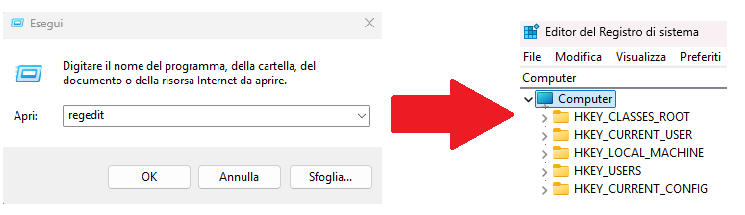

# Windows Forensics

La maggior parte dei dispositivi Desktop utilizza ```Microsoft Windows```, circa l'**80**%.     
Quindi è molto importante saper operare su sistemi che utilizzano Windows.


## 🔎 Artefatti forensi

Un artefatto forense è una qualunque "**impronta digitale**" che ci permette di ricostruire **le azioni svolte da un utente o da un processo**.
Spesso queste prove si trovano in posti in cui normalmente un utente non si avventurerebbe.  
*Questi artefatti possono includere:*
- File di log
- Chiavi di registro
- File temporanei
- Cronologia del browser
- File di configurazione
- Prefetch e ShimCache
---
### A cosa servono quindi?

Gli artefatti sono fondamentali per:
- Ricostruire una timeline
- Identificare attività sospette
- Dimostrare la presenza o l’uso di software malevolo
---

## 🪟 Registri di Windows

Sono dei contenitori che immagazzinano dati, riguardo:
- hardware
- software
- informazione riguardanti l'utente
- file utilizzati recentemente
- programmi utilizzati
- dispositivi collegati al sistema

>I registri di Windows sono composti da ```Chiave (Key)``` e ```Valore (Value)```:    
I **valori** di un registro sono i **dati** contenuti nelle chiavi del registro.             
Un ```Registry Hive``` è un gruppo di chiavi, sottochiavi e valori immagazzinati in un singolo file sul disco


| Esempi di Registry Hive:   | Cosa contiene                       |
|--------------------------- |-------------------------------------|
| HKEY_LOCAL_MACHINE\SYSTEM  | Configurazioni hardware e driver   |
| HKEY_LOCAL_MACHINE\SOFTWARE| Impostazioni software e applicazioni|
| HKEY_LOCAL_MACHINE\SAM     | Account e credenziali locali        |
| HKEY_LOCAL_MACHINE\SECURITY| Policy di sicurezza                 |


---

## 🧩 Struttura del Registro di sistema
Il Registro di sistema di Windows è organizzato in `cinque chiavi root` principali:

- `HKEY_CURRENT_USER`
- `HKEY_USERS`
- `HKEY_LOCAL_MACHINE`
- `HKEY_CLASSES_ROOT`
- `HKEY_CURRENT_CONFIG`
---


### 🧩 Le 5 chiavi radice del Registro di sistema

| Root Key:   | Contenuto principale                       |
|--------------------------- |-------------------------------------|
| HKEY_CLASSES_ROOT (HKCR)| **Associazioni tra file e applicazioni**: estensioni, COM, shell|
| HKEY_CURRENT_USER (HKCU)| **Impostazioni dell’utente attualmente loggato**: desktop, stampanti, preferenze|
| HKEY_LOCAL_MACHINE (HKLM)  | **Impostazioni globali del sistema**: hardware, driver, software installato, sicurezza   |
| HKEY_USERS (HKU)     | **Impostazioni di tutti gli utenti** del sistema, inclusi profili non attivi|
| HKEY_CURRENT_CONFIG (HKCC)  | **Configurazioni hardware correnti**: monitor, stampanti, profili attivi   |

### Note riguardo la HKCR
Gestisce le associazioni tra estensioni di file e applicazioni.
>“Quando l’utente apre un .docx, quale programma deve essere usato?

HKCR è una fusione dinamica di due chiavi: 

- **HKEY_LOCAL_MACHINE**\Software\Classes: `impostazioni globali`
- **HKEY_CURRENT_USER**\Software\Classes: `override utente`     
Se esiste un conflitto, Windows dà priorità alle impostazioni utente
---

## ⛔ Accedere ai registry hives da immagine del disco (offilne)
Se il sistema è live possiamo accedere dal regedit, mentre se lavoriamo post-mortem allora dopo aver fatto `l'immagine del disco` con strumenti come **FTK Imager** possiamo:  
Andare a questo percorso: `C:\Windows\System32\Config` che contiene:
- DEFAULT (mounted on HKEY_USERS\DEFAULT)
- SAM (mounted on HKEY_LOCAL_MACHINE\SAM)
- SECURITY (mounted on HKEY_LOCAL_MACHINE\Security)
- SOFTWARE (mounted on HKEY_LOCAL_MACHINE\Software)
- SYSTEM (mounted on HKEY_LOCAL_MACHINE\System)   
>Quando il sistema viene avviato, il file hive in questione viene *montato* (cioè caricato) e diventa accessibile tramite la chiave HKEY_...

### 👤 Hive contenenti informazioni riguardanti l'utente
Situati in `C:\Users\<username>\`, in particolare troviamo:
- **NTUSER.DAT** (mounted on HKEY_CURRENT_USER quando un utente logga)
- **USRCLASS.DAT** (mounted on HKEY_CURRENT_USER\Software\CLASSES)   
L'USRCLASS.DAT hive si trova nella directory: `C:\Users\<username>\AppData\Local\Microsoft\Windows`   
>E sono entrambi file *nascosti*

### 📒 Amcache Hive:
Questo hive si trova in `C:\Windows\AppCompat\Programs\Amcache.hve`.  
Windows crea questo hive per salvare informazioni sui **programmi che sono stati eseguiti recentemente** sul sistema.

## 🧾 Transaction Logs e Backup del Registro

Oltre ai file hive, esistono altre fonti importanti di dati forensi nel Registro di sistema:

---

### 📘 Transaction Logs

I **transaction logs** sono file di log che registrano le **modifiche recenti** ai file hive.  
Windows li usa durante la scrittura nei file hive per garantire integrità e recupero in caso di errore.

- Possono contenere **dati più aggiornati** rispetto al file hive stesso
- Si trovano nella stessa directory del file hive: `C:\Windows\System32\Config`
- Hanno lo stesso nome del hive ma con estensione `.LOG`, `.LOG1`, `.LOG2`…

📌 Esempio:  
Il log del hive `SAM` → `C:\Windows\System32\Config\SAM.LOG`

In analisi forense, è utile esaminarli per **identificare modifiche recenti non ancora scritte** nel hive.

---

### 🗂️ Backup del Registro

I **backup** sono copie dei file hive salvate da Windows ogni **10 giorni**.

- Percorso: `C:\Windows\System32\Config\RegBack`
- Possono aiutare a **recuperare chiavi eliminate o modificate**
- Utile confrontare con la versione attuale per **identificare variazioni e manomissioni**

---

✅ In sintesi:  
- I **transaction logs** mostrano modifiche recenti  
- I **backup** permettono di confrontare lo stato passato del Registro

---
### Risposte domande:
- What is the short form for HKEY_LOCAL_MACHINE?
`HKLM`
- What is the path for the five main registry hives, DEFAULT, SAM, SECURITY, SOFTWARE, and SYSTEM?  `C:\Windows\System32\Config`
- What is the path for the AmCache hive?        `C:\Windows\AppCompat\Programs\Amcache.hve`
  
---

🔗 [TryHackMe – Windows Forensics 1 (da modulo 1 a 3)](https://tryhackme.com/room/windowsforensics1)

---

>📄Documento curato da **Diego Bonatti**  
💻Portfolio tecnico: [GitHub](https://github.com/diego-bonatti)  
📬Contatto: diego.bonatti.fdi@gmail.com