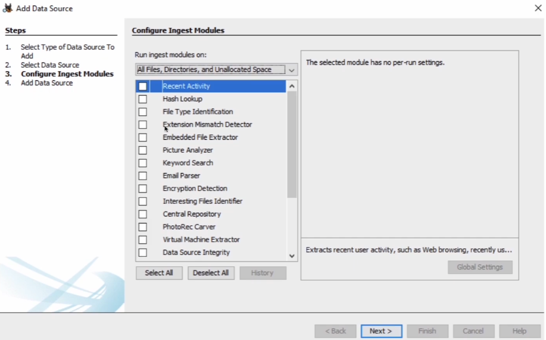
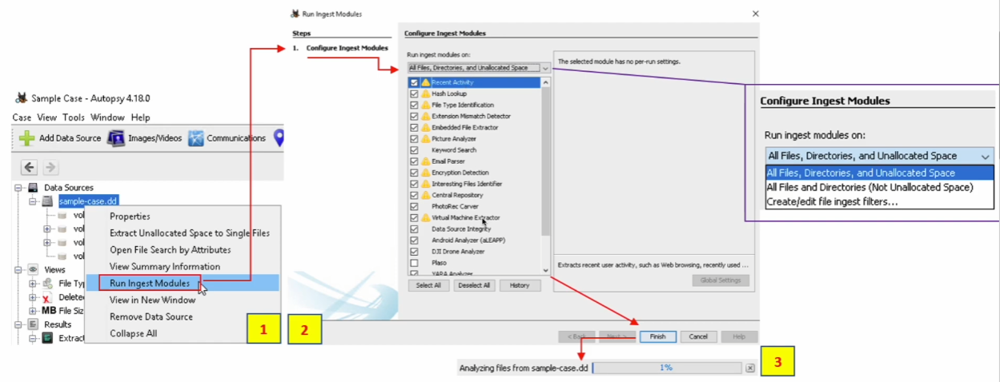
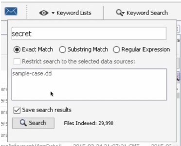
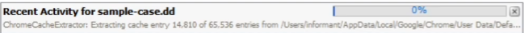
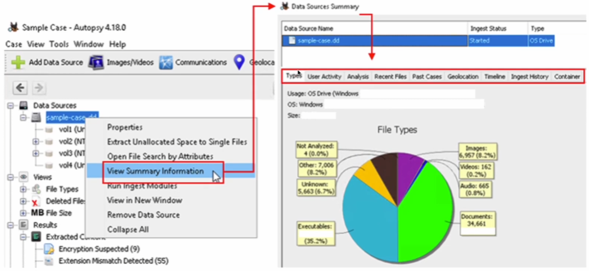
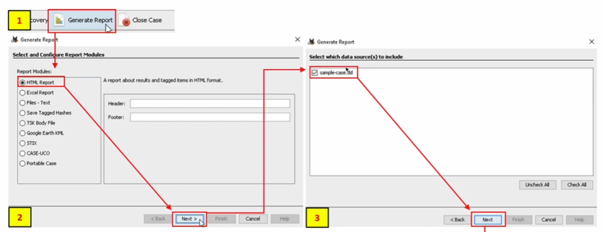
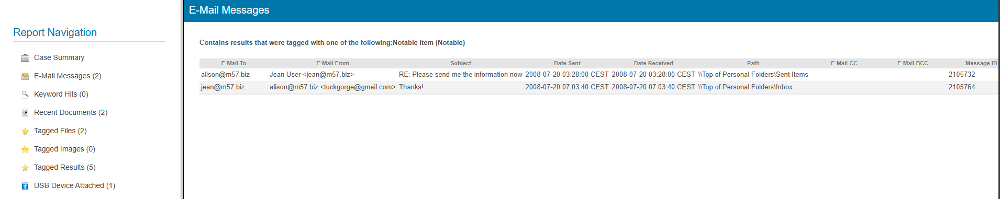
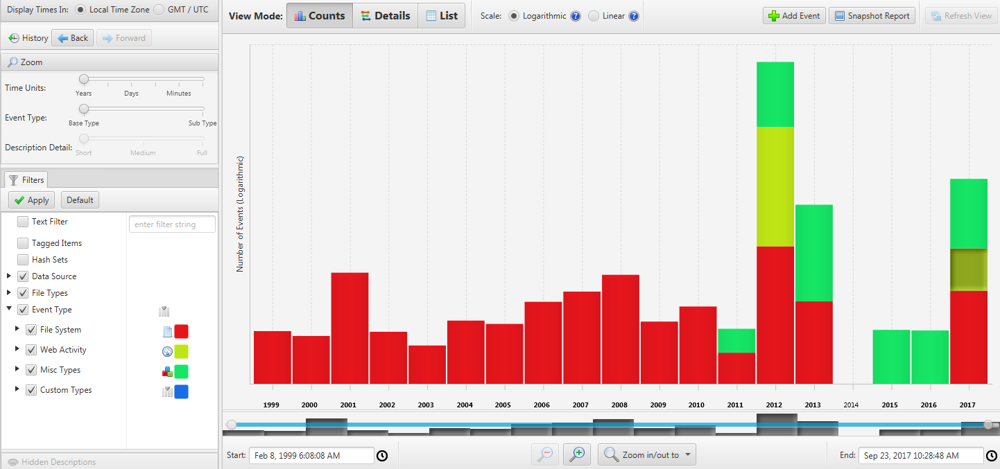

# Autopsy

>[!NOTE]
I file Autopsy (i casi) hanno estensione `.aut`

## Data Sources 

Formati di immagini di dischi supportati:

- Raw Single
- Raw Split
- EnCase
- Virtual Machines

>[!NOTE]
Se ci sono **multiple immagini** (E01, E02, E03, ...) ad Autopsy basta dare in **input .E01** e Autopsy farà il resto (file devono avere lo **stesso nome**).

Formato **EnCase**: .E01, E02, ...

## Ingest Modules

Quando inseriamo la data source ci chiederà quali dati cercare, estrarrà questi dati in base ai moduli che selezioneremo.

https://sleuthkit.org/autopsy/docs/user-docs/

Applicare i moduli **dopo aver inserito la risorsa**:

## User Interface (Part 1)

### Tree Viewer

Il Tree Viewer ha 5 nodi principali:

- **Data Sources**
- **Views**
- **Results**
- **Tags**
- **Reports**

**Data Sources**: contiene i volumi e cliccando i volumi possiamo accedere a più informazioni riguardo ad essi.

### Content Viewer

Dopo aver cliccato su un file o una cartella otteniamo più informazioni tramite il content viewer, dove:

- `S` = **Score** (Se il file è "sospetto" o interessante)
- `C` = **Comment** (Se presente un commento a riguardo)
- `O` = **Occurrence** (Quante volte è stato visto negli altri casi)

### Keyword Search

### Status Area

In basso a destra che indica quando un Ingest Module è in esecuzione, tramite una barra di caricamento.  

## User Interface (Part 2)

Si può generare un **Report** cliccando "Generate Report" nella barra in alto.

Esempio di report HTML del caso M57-Jean, di soli Notable Items:

## Visualisation Tools

Esempio di Timeline in Autopsy:

>La Timeline è composta da 3 **aree**:

- `Filters`: riducono i dati visualizzati
- `Events`: attività che si sono veirifcate nel tempo
- `Files/Contents`: informazioni aggiuntive riguardo agli eventi

>Nella timeline abbiamo 3 **modalità di visualizzazione** (View Modes)

- `Counts`: numero di eventi
- `Details`: informazioni riguardo agli eventi (clustered/collapsed)
- `List`: eventi mostrati in una tabella
  

>Per **espandere** un cluster cliccare sull'icona verde con un "+".  
Per **pinnare** un cluster cliccare sull'icona bianca con un segnalino rosso.  
Per **nascondere** un cluster cliccare sull'icona bianca con un occhio.  

---
🔗 [TryHackMe – Autopsy](https://tryhackme.com/room/btautopsye0)

---

>Documento curato da **Diego Bonatti**  
Portfolio tecnico: [GitHub](https://github.com/diego-bonatti)

