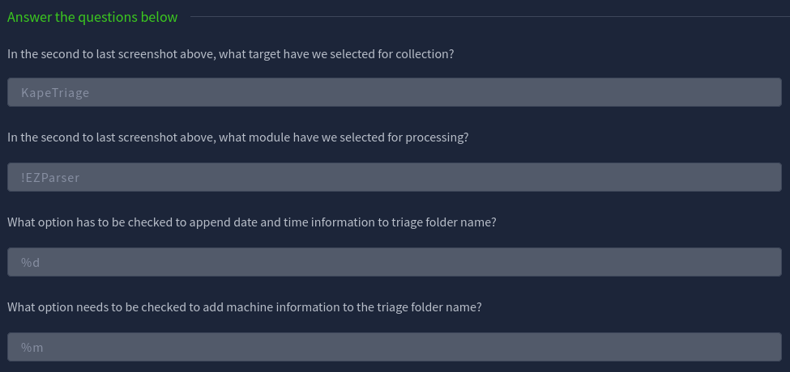
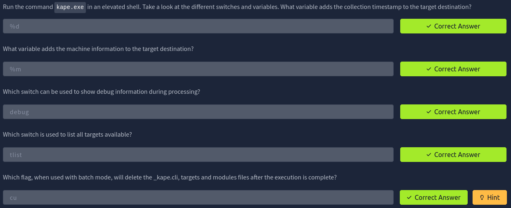

# Utilizzo di KAPE

Programma per estrarre artefatti da dispositivi live, molto più veloce
che aspettare l'imaging completo del disco.

- Estrae artefatti che ci interessano (grazie ai **target**)
- Processa gli artefatti (grazie ai **moduli**) 

## Come avviene la copia

La lista di file selezionata dalla categoria target viene processata,
cercando di copiare più files possibile (tutti quelli non **bloccati dall'OS**).  
I files di cui la copia è stata bloccata dall'OS entrano in un'altra coda, dove vengono copiati usando l'accesso diretto ai bit del disco (parliamo quindi di **RAW Copy)**


## 🎯 Target Options

Rappresentano gli artefatti che devono essere **collezionati da un sistema o da un'immagine** e poi **copiati** nella destinazione che abbiamo specificato.

>[!NOTE]
> I targets in KAPE sono definiti con l'estensione `.tkape`.  
> Contiene informazioni sull'artefatto che vogliamo acquisire 

---

### Compound Targets

>È l'**insieme di più piccoli targets**.  
Questo insieme ci semplifica l'acquisizione, rendendola più veloce e più efficace rispetto all'acquisire uno alla volta questi targets.

Esempii di Compound Targets:

- `!BasicCollection`
- `!SANS_triage`
- `KAPEtriage`

!Disabled e !Local sono altre directory che svolgono funzioni sui targets.

- Contiene targets che non voglio che appaiano nella lista di Targets attivi

- Targets che non voglio che vengano sincronizzati con la repository di KAPE su Github


## 🧾 Module Options

>Prendono i dati raccolti prima dalla fase Target e li elaborano in base al modulo scelto.   
Di solito in output abbiamo un file .csv.   

Anche qui esiste il concetto di Compund Module, i file dei moduli hanno estensione: `mkape`.

Ai moduli sono necessari degli eseguibili per poter funzionare, se essi mancano allora entra in gioco la cartella bin.  
Questa cartella bin contiene gli eseguibili di cui i moduli hanno bisogno per poter funzionare.  


## Parametri Di KAPE


- `Flush`: elimina tutti i files dalla cartella di destinazione
- `Add %d`: aggiunge info del nome della directory ai dati salvati
- `Add %m`: aggiunge info del dispositivo nella Target destination directory
- `Process VSCs`: processa anche le Volume Shadow Copies  
- `Transfer`: per trasferire i files attraverso un **server SFTP o S3 Bucket** (i files devono essere in un container, identificato da un Base Name).

### Esempio

>Acquisizione di **KapeTriage** ed elaborazione con modulo: **EZParser**.


- Risposte alla domande:




---
### Esempio KAPE CLI (Command Line)


```powershell
kape.exe --tsource C: --target KapeTriage --tdest C:\Users\thm-4n6\Desktop\Target --mdest C:\Users\thm-4n6\Desktop\module --module !EZParser
```
```bash
kape.exe 
```
per ottenere più informazioni aggiuntive riguardo a flags...





